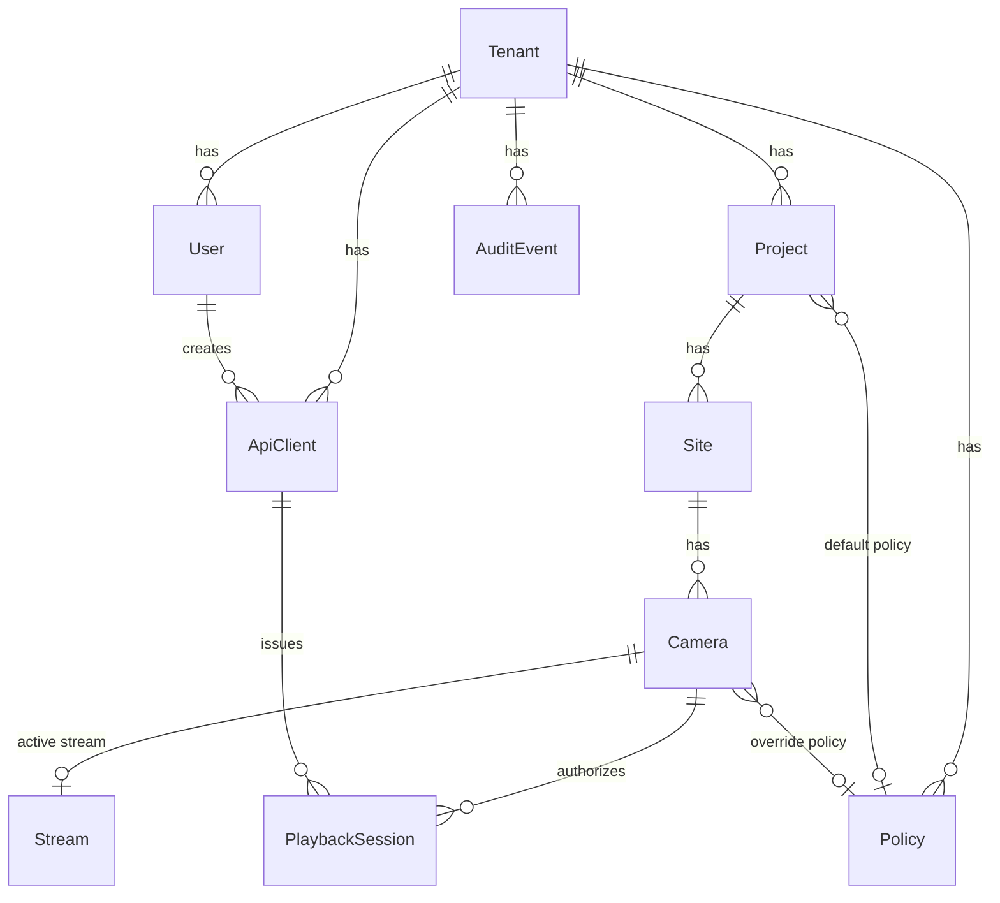
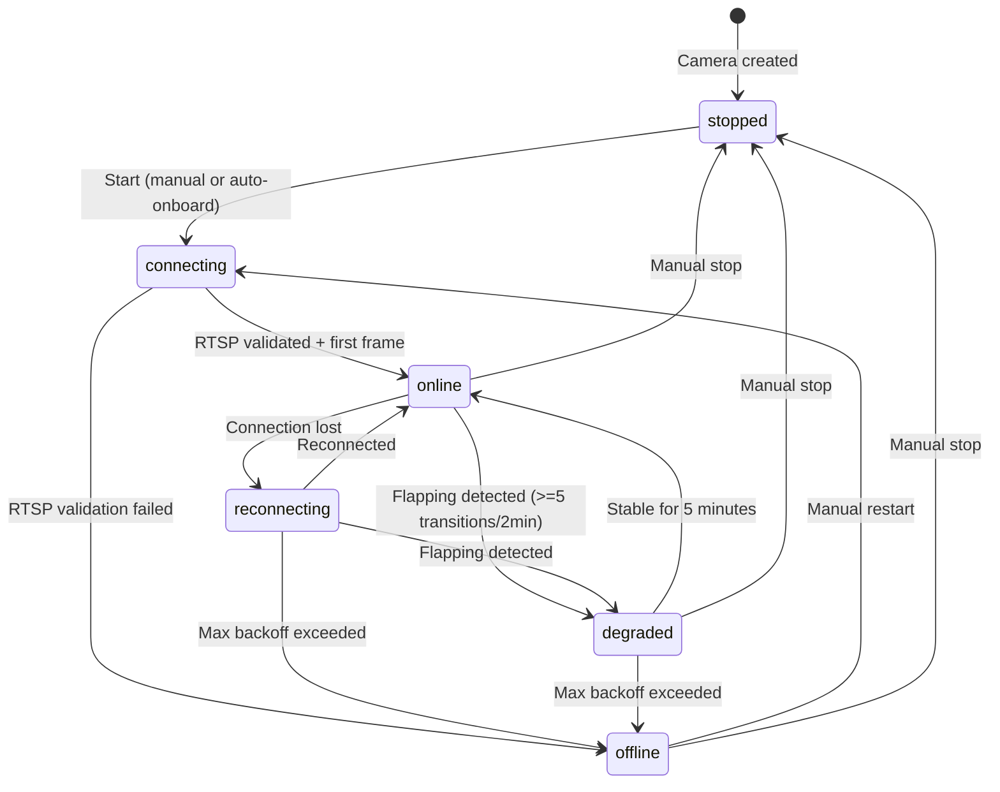

# Data Model: B2B CCTV Streaming Platform

**Date**: 2026-03-22
**ORM**: Drizzle ORM (PostgreSQL)
**Isolation**: Row-Level Security with `tenant_id` on every table

## Entity Relationship Diagram

## Tables

### tenants

| Column | Type | Constraints | Notes |
|--------|------|-------------|-------|
| id | uuid | PK, default gen_random_uuid() | |
| name | varchar(255) | NOT NULL | |
| slug | varchar(63) | NOT NULL, UNIQUE | URL-safe identifier |
| billing_email | varchar(255) | NOT NULL | |
| subscription_tier | enum('free','starter','pro','enterprise') | NOT NULL, default 'free' | |
| viewer_hours_quota | integer | NOT NULL, default 1000 | Monthly quota |
| egress_quota_bytes | bigint | NOT NULL, default 107374182400 | 100 GB default |
| created_at | timestamptz | NOT NULL, default now() | |
| updated_at | timestamptz | NOT NULL, default now() | |

RLS: `tenant_id = current_setting('app.tenant_id')::uuid`

### users

| Column | Type | Constraints | Notes |
|--------|------|-------------|-------|
| id | uuid | PK | |
| tenant_id | uuid | NOT NULL, FK tenants(id) | RLS column |
| email | varchar(255) | NOT NULL | Unique per tenant |
| name | varchar(255) | NOT NULL | |
| keycloak_sub | varchar(255) | UNIQUE | OIDC subject claim |
| role | enum('admin','operator','developer','viewer') | NOT NULL | |
| mfa_enabled | boolean | NOT NULL, default false | |
| last_login | timestamptz | | |
| created_at | timestamptz | NOT NULL, default now() | |

Unique constraint: (tenant_id, email)

### api_clients

| Column | Type | Constraints | Notes |
|--------|------|-------------|-------|
| id | uuid | PK | |
| tenant_id | uuid | NOT NULL, FK tenants(id) | RLS column |
| user_id | uuid | NOT NULL, FK users(id) | Creator |
| key_prefix | varchar(8) | NOT NULL | First 8 chars for identification |
| key_hash | varchar(128) | NOT NULL | SHA-256 hash of full key |
| label | varchar(255) | NOT NULL | Human-readable name |
| rate_limit_override | integer | | Null = use policy default |
| last_used_at | timestamptz | | |
| revoked_at | timestamptz | | Null = active |
| created_at | timestamptz | NOT NULL, default now() | |

### projects

| Column | Type | Constraints | Notes |
|--------|------|-------------|-------|
| id | uuid | PK | |
| tenant_id | uuid | NOT NULL, FK tenants(id) | RLS column |
| name | varchar(255) | NOT NULL | |
| description | text | | |
| default_policy_id | uuid | FK policies(id) | Nullable |
| viewer_hours_quota | integer | | Null = shares tenant pool |
| public_key | varchar(32) | NOT NULL, UNIQUE | For public map API |
| created_at | timestamptz | NOT NULL, default now() | |
| updated_at | timestamptz | NOT NULL, default now() | |

### sites

| Column | Type | Constraints | Notes |
|--------|------|-------------|-------|
| id | uuid | PK | |
| project_id | uuid | NOT NULL, FK projects(id) | |
| tenant_id | uuid | NOT NULL, FK tenants(id) | RLS column |
| name | varchar(255) | NOT NULL | |
| address | text | | |
| lat | double precision | | |
| lng | double precision | | |
| timezone | varchar(63) | NOT NULL, default 'UTC' | |
| created_at | timestamptz | NOT NULL, default now() | |

### cameras

| Column | Type | Constraints | Notes |
|--------|------|-------------|-------|
| id | uuid | PK | |
| site_id | uuid | NOT NULL, FK sites(id) | |
| tenant_id | uuid | NOT NULL, FK tenants(id) | RLS column |
| name | varchar(255) | NOT NULL | |
| rtsp_url | text | NOT NULL | |
| credentials_encrypted | bytea | | AES-256-GCM encrypted |
| lat | double precision | | |
| lng | double precision | | |
| tags | jsonb | NOT NULL, default '[]' | |
| map_visible | boolean | NOT NULL, default false | |
| health_status | enum('connecting','online','degraded','offline','reconnecting','stopped') | NOT NULL, default 'stopped' | |
| policy_id | uuid | FK policies(id) | Override project policy |
| thumbnail_url | text | | |
| thumbnail_updated_at | timestamptz | | |
| created_at | timestamptz | NOT NULL, default now() | |
| updated_at | timestamptz | NOT NULL, default now() | |
| version | integer | NOT NULL, default 1 | Optimistic concurrency |

### streams

| Column | Type | Constraints | Notes |
|--------|------|-------------|-------|
| id | uuid | PK | |
| camera_id | uuid | NOT NULL, FK cameras(id), UNIQUE | 1:1 when active |
| tenant_id | uuid | NOT NULL, FK tenants(id) | RLS column |
| ingest_node_id | varchar(63) | NOT NULL | MediaMTX instance ID |
| codec | varchar(16) | | e.g., H.264, H.265 |
| resolution | varchar(16) | | e.g., 1920x1080 |
| bitrate_kbps | integer | | |
| started_at | timestamptz | NOT NULL, default now() | |
| last_segment_at | timestamptz | | |

### playback_sessions

| Column | Type | Constraints | Notes |
|--------|------|-------------|-------|
| id | uuid | PK | Also used as jti |
| camera_id | uuid | NOT NULL, FK cameras(id) | |
| tenant_id | uuid | NOT NULL, FK tenants(id) | RLS column |
| api_client_id | uuid | NOT NULL, FK api_clients(id) | |
| issued_at | timestamptz | NOT NULL, default now() | |
| expires_at | timestamptz | NOT NULL | |
| allowed_origins | text[] | | Null = no restriction |
| viewer_ip | inet | | |
| status | enum('active','expired','revoked') | NOT NULL, default 'active' | |
| revoked_at | timestamptz | | |

Index: (camera_id, status) for active session lookups
Index: (tenant_id, issued_at) for audit queries
Partition: by issued_at (monthly) for large-scale deployments

### policies

| Column | Type | Constraints | Notes |
|--------|------|-------------|-------|
| id | uuid | PK | |
| tenant_id | uuid | NOT NULL, FK tenants(id) | RLS column |
| name | varchar(255) | NOT NULL | |
| ttl_min | integer | NOT NULL, default 60 | Seconds |
| ttl_max | integer | NOT NULL, default 300 | Seconds |
| ttl_default | integer | NOT NULL, default 120 | Seconds |
| domain_allowlist | text[] | | Null = allow all |
| rate_limit_per_min | integer | NOT NULL, default 100 | |
| viewer_concurrency_limit | integer | NOT NULL, default 50 | Per camera |
| created_at | timestamptz | NOT NULL, default now() | |
| updated_at | timestamptz | NOT NULL, default now() | |
| version | integer | NOT NULL, default 1 | Optimistic concurrency |

### audit_events

| Column | Type | Constraints | Notes |
|--------|------|-------------|-------|
| id | uuid | PK | |
| tenant_id | uuid | NOT NULL, FK tenants(id) | RLS column |
| timestamp | timestamptz | NOT NULL, default now() | |
| actor_type | enum('user','api_client','system') | NOT NULL | |
| actor_id | uuid | | Null for system events |
| event_type | varchar(63) | NOT NULL | e.g., session.issued |
| resource_type | varchar(63) | | e.g., camera, session |
| resource_id | uuid | | |
| details | jsonb | | Event-specific payload |
| source_ip | inet | | |

Partition: by timestamp (monthly)
Retention: 90 days hot, then auto-purge (export-before-purge)
Index: (tenant_id, timestamp) for range queries
Index: (tenant_id, event_type) for type filtering

## State Machine: Camera Health

## Redis Key Structure

| Key Pattern | Value | TTL | Notes |
|-------------|-------|-----|-------|
| `session:{jti}` | `{camera_id, allowed_origins, expires_at, tenant_id}` | 60–300s | Token validation |
| `ratelimit:{api_client_id}:{window_ts}` | counter (integer) | 60s | Sliding window |
| `replay:{jti}` | `1` | 24h | Revoked session IDs |
| `camera:health:{camera_id}` | `{status, last_segment_at, codec, resolution}` | 30s | Cached health |
| `thumbnail:{camera_id}` | `{url, updated_at, stale}` | 10s | Cached thumbnail |
| `quota:viewer_hours:{tenant_id}:{month}` | counter (float, hours) | 35 days | Usage tracking |
| `quota:viewer_hours:{project_id}:{month}` | counter (float, hours) | 35 days | Per-project quota |
