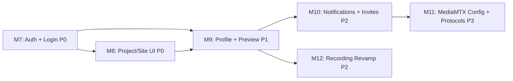

# Implementation Plan: B2B CCTV Streaming Platform

**Branch**: `001-cctv-streaming-platform` | **Date**: 2026-03-22 | **Spec**: [spec.md](./spec.md)
**Updated**: 2026-03-22 — Added M7–M10 for US8–US18 (gap analysis features)

## Summary

Build a multi-tenant B2B CCTV streaming platform as a pnpm + Turborepo monorepo. The system ingests RTSP from IP cameras via MediaMTX, repackages to HLS/LL-HLS (no transcoding), and delivers secure playback through signed short-lived sessions. The Control Plane (Hono REST API + Next.js console) handles tenant/camera management, RBAC, and audit. The Data Plane (worker + MediaMTX) handles ingest, packaging, and origin serving.

**Update**: Gap analysis identified 11 missing features (US8–US18) including authentication, project/site UI, profile, stream preview, notifications, user invitations, MediaMTX config UI, WebRTC, SRT, and stream forwarding.

## Technical Context

**Language/Version**: TypeScript 5.x on Node.js 22.x LTS
**Primary Dependencies**: Hono 4.x (API), Next.js 15.x (Console), Drizzle ORM 0.38.x (DB), Zod 3.x (validation), shadcn/ui (UI), MediaMTX 1.x (streaming), hls.js 1.x (player), Leaflet 1.9.x (map)
**Storage**: PostgreSQL 17.x (primary), Redis 7.x (sessions/cache/rate-limit)
**Auth**: Keycloak 26.x (OIDC/OAuth2)
**Testing**: Vitest (unit/integration), Playwright (E2E), k6 (load)
**Target Platform**: Linux server (Docker), On-Prem HCI (3-node), SaaS (Kubernetes)
**Project Type**: Multi-service monorepo (3 apps + 4 packages)

**New dependencies for US8–US18**:
- `next-auth` v5 (Auth.js) — Keycloak OIDC integration for Next.js
- `@auth/core` — Auth.js core for session management
- `sonner` — Toast notifications (already installed via shadcn)
- SSE or WebSocket — Real-time notifications (Redis Pub/Sub → SSE endpoint)

## Constitution Check

All original 10 gates PASS. New features maintain compliance:

| Principle | Status | New Feature Impact |
|-----------|--------|-------------------|
| I. Open-Source First | PASS | next-auth is OSS, Keycloak for OIDC, no proprietary additions |
| II. Control/Data Plane Separation | PASS | All new features are Control Plane (auth, UI, notifications) |
| III. HLS/LL-HLS First | PASS | WebRTC (US16) is explicitly optional with HLS fallback |
| IV. Security by Default | PASS | Login (US8) strengthens security; invitation has 48h expiry |
| V. Minimize Transcoding | PASS | SRT ingest (US17) uses same copy/repackage pipeline |
| VI. Operations-Ready | PASS | MediaMTX config UI (US15) improves operational capability |

## Milestones (Updated)

### Existing Milestones (M0–M6) — COMPLETED

- M0: Foundations — Done (30 tasks)
- M1: Control Plane MVP — Done (22 tasks)
- M2: Data Plane MVP — Done (17 tasks via US1)
- M3: E2E Streaming — Done (11 tasks via US2)
- M4: Map + Click-to-Play — Done (9 tasks via US3)
- M5: Scale & Hardening — Done (polish tasks)
- M6: Optional Enhancements — Deferred to M10

### New Milestones



### M7: Authentication & Login (P0) — US8

**Scope**: Keycloak OIDC login flow for console-web

**Deliverables**:
- Login page at `/login` with Keycloak redirect
- next-auth (Auth.js v5) integration with Keycloak provider
- Session middleware protecting all `(auth)` routes
- User info display in sidebar header (name, role)
- Logout button + session termination
- "Session expired" redirect handling

**Acceptance**: Unauthenticated user → redirected to login → Keycloak auth → back to dashboard with identity visible.

**Risks**: Keycloak token refresh timing. Mitigation: Configure refresh token rotation in next-auth.

### M8: Project & Site Management UI (P0) — US9

**Scope**: Console pages for managing the project/site hierarchy

**Deliverables**:
- `/projects` page — DataTable with CRUD, create dialog
- `/projects/[id]` page — Project detail with sites list
- `/projects/[id]/sites` — Sites DataTable with CRUD
- `/sites/[id]` page — Site detail with cameras list, map pin
- Hierarchical breadcrumb navigation
- Delete protection (cannot delete site with cameras)
- Sidebar navigation update (Projects submenu)

**Acceptance**: Create project → create site → see hierarchy → cameras appear under site.

### M9: Profile, Stream Preview, Embedded Player (P1) — US10, US11, US12

**Scope**: User account management + inline stream viewing

**Deliverables**:
- `/profile` page — Edit name, email, password, MFA toggle
- Camera detail sheet — inline hls.js player for online cameras
- `/play` public page — Standalone HLS player accepting `?token=` param
- Session auto-issuance for preview, auto-revoke on close

**Acceptance**: Edit profile → see changes. Open camera detail → live preview plays. Open `/play?token=xxx` → stream plays.

### M10: Notifications & User Invitations (P2) — US13, US14

**Scope**: Real-time alerts + email-based user onboarding

**Deliverables**:
- Notification bell icon in console header with badge count
- SSE endpoint (`/api/v1/notifications/stream`) pushing events from Redis Pub/Sub
- Notification dropdown (last 20, click-through, mark as read)
- `notifications` DB table (id, user_id, tenant_id, type, message, read, link, created_at)
- User invitation API (POST /users/invite) with email + role
- `invitations` DB table (id, tenant_id, email, role, token, expires_at, accepted_at)
- Invitation acceptance page at `/invite/[token]`
- "Pending" status in user list

**Acceptance**: Camera goes offline → bell badge appears within 10s. Admin invites user → email sent → user accepts → can login.

### M11: MediaMTX Config UI + Optional Protocols (P3) — US15, US16, US17, US18

**Scope**: Advanced MediaMTX management + protocol expansion

**Deliverables**:
- `/settings/mediamtx` page — View/edit MediaMTX config via Control API
- Hot-reload config changes without stream interruption
- WebRTC toggle in player (HLS ↔ WebRTC switch with auto-fallback)
- SRT URL support in camera onboarding form (`srt://` prefix)
- Stream forwarding configuration page (push rules to RTMP endpoints)

**Acceptance**: Change MediaMTX config → applied without interruption. WebRTC player < 1s latency. SRT camera ingest → HLS output.

### M12: Recording Revamp (P2-Commercial) — US37

**Scope**: Complete recording feature with browse UI, settings, detail page, scope-based config

**Deliverables**:

**Browse Page (tab: Browse)**:
- Card view (default) with thumbnails from thumbnail worker
- YouTube-style muted hover preview on cards
- Table view with sortable columns and inline thumbnails
- Single date-range picker (not separate from/to)
- Bulk select with per-file download and delete
- View toggle (Card/Table)

**Recording Detail Page** (`/recordings/[cameraId]`):
- HLS VOD player with signed session URLs
- 24h timeline bar showing recording coverage (click to seek)
- Day navigation (prev/next) with clips table
- Camera recording info showing mode, retention, storage, inheritance source

**Settings Tab (tab: Settings)**:
- Global recording defaults (mode, retention, storage, quality, auto-purge)
- Scope overrides (Site → Project → Camera) with inheritance
- Storage usage dashboard (total used, top cameras)

**Backend**:
- `recording_configs` table for scope-based settings
- Config CRUD API: GET/PUT/DELETE `/recording-config/:scopeType/:scopeId`
- Storage usage API: GET `/recording-config/storage-usage`
- MediaMTX webhook: POST `/internal/recording/event` (start/stop)
- Feature gate: `requireFeature("recording")` on all recording routes
- VOD signed session with origin base URL
- Purge job deletes DB records + physical files

**Recording Scope Inheritance**:
```
Global Default (Settings tab)
 └── Site override
      └── Project override
           └── Camera override (closest scope wins)
```

**Recording Modes**: continuous | scheduled | event_based

**Acceptance**: Enable recording per camera → MediaMTX records → webhook populates DB → browse in Card/Table view → click card → detail page with timeline + player → settings override per scope.

**Components Created**:
```
components/recordings/
├── recording-card.tsx        # Card + thumbnail + hover preview
├── recording-table.tsx       # Sortable table view
├── recording-timeline.tsx    # 24h timeline bar
├── recording-player.tsx      # VOD player wrapper
├── settings-tab.tsx          # Global config + overrides + storage
├── date-range-picker.tsx     # Single date range component
├── view-toggle.tsx           # Card/Table switch
├── bulk-actions.tsx          # Download/delete bar
└── types.ts                  # Shared Recording interface

app/(auth)/recordings/
├── page.tsx                  # Main page (Browse + Settings tabs)
└── [cameraId]/page.tsx       # Detail page (per-camera)
```

## New Data Model Additions

### notifications

| Column | Type | Notes |
|--------|------|-------|
| id | uuid PK | |
| user_id | uuid FK users | Recipient |
| tenant_id | uuid FK tenants | RLS |
| type | varchar(63) | camera.offline, session.denied, etc. |
| title | varchar(255) | |
| message | text | |
| link | text | Click-through URL |
| read | boolean, default false | |
| created_at | timestamptz | |

### invitations

| Column | Type | Notes |
|--------|------|-------|
| id | uuid PK | |
| tenant_id | uuid FK tenants | |
| email | varchar(255) | Invitee |
| role | user_role enum | Assigned role |
| token | varchar(64) UNIQUE | Invitation token |
| invited_by | uuid FK users | |
| expires_at | timestamptz | 48h from creation |
| accepted_at | timestamptz nullable | Null = pending |

### recording_configs

| Column | Type | Notes |
|--------|------|-------|
| id | uuid PK | |
| tenant_id | uuid FK tenants | RLS |
| scope_type | varchar(20) | global / site / project / camera |
| scope_id | uuid nullable | Entity ID (null for global) |
| mode | varchar(20) | continuous / scheduled / event_based |
| schedule | jsonb | Time windows (for scheduled mode) |
| retention_days | integer | 1-90 (limited by plan) |
| auto_purge | boolean | Auto-delete expired recordings |
| storage_type | varchar(20) | local / s3 |
| storage_path | varchar(500) | Local path |
| s3_config | jsonb | Bucket/region/keys |
| format | varchar(10) | fmp4 / mkv |
| resolution | varchar(10) | original / 720p / 480p |
| max_segment_size_mb | integer | Max file size per segment |
| enabled | boolean | Recording on/off |
| created_at | timestamptz | |
| updated_at | timestamptz | |

**Unique index**: (tenant_id, scope_type, scope_id)

## New API Endpoints

### Auth
- `GET /auth/login` — Redirect to Keycloak
- `GET /auth/callback` — OIDC callback
- `POST /auth/logout` — Terminate session

### Notifications
- `GET /api/v1/notifications` — List user notifications (paginated)
- `POST /api/v1/notifications/:id/read` — Mark as read
- `POST /api/v1/notifications/read-all` — Mark all as read
- `GET /api/v1/notifications/stream` — SSE endpoint for real-time push

### Invitations
- `POST /api/v1/users/invite` — Send invitation (Admin)
- `GET /api/v1/invitations/:token` — Validate invitation token (Public)
- `POST /api/v1/invitations/:token/accept` — Accept invitation (Public)

### MediaMTX Config
- `GET /api/v1/mediamtx/config` — Get current config
- `PATCH /api/v1/mediamtx/config` — Update config (hot-reload)
- `GET /api/v1/mediamtx/paths` — List active paths

### Recording Config
- `GET /api/v1/recording-config/:scopeType/:scopeId?` — Get effective config
- `PUT /api/v1/recording-config/:scopeType/:scopeId?` — Upsert config
- `DELETE /api/v1/recording-config/:scopeType/:scopeId` — Remove override
- `GET /api/v1/recording-config/storage-usage` — Storage summary

### Recording Webhook (Internal)
- `POST /internal/recording/event` — MediaMTX recording start/stop events

## Timeline

| Milestone | Effort | Dependencies | Status |
|-----------|--------|-------------|--------|
| M7: Auth & Login | Small | None (P0, do first) | Done |
| M8: Project/Site UI | Small | M7 (needs auth) | Done |
| M9: Profile + Preview + Player | Medium | M7 + M8 | Done |
| M10: Notifications + Invitations | Medium | M7 | Done |
| M11: MediaMTX Config + Protocols | Medium | M8 | Done |
| M12: Recording Revamp | Large | M9 | Done |

## Testing Strategy (New Features)

- **Auth**: E2E Playwright test for login → dashboard → logout flow
- **Project/Site UI**: Integration test CRUD operations + hierarchy
- **Notifications**: Unit test SSE delivery + integration test Redis Pub/Sub → notification
- **Invitations**: Integration test invite → accept → login flow
- **WebRTC**: Manual test with coturn TURN server
