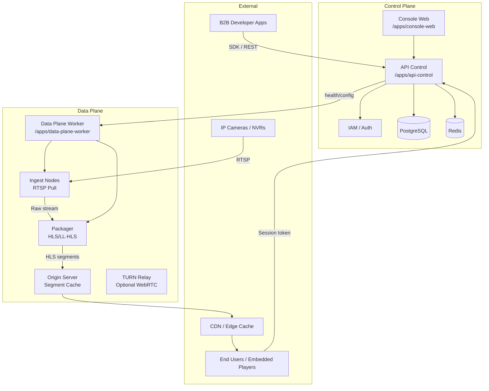
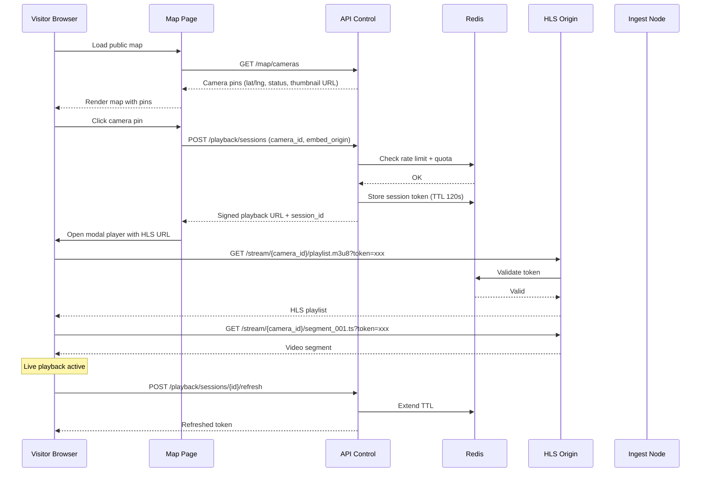

# Feature Specification: B2B CCTV Streaming Platform

**Feature Branch**: `001-cctv-streaming-platform`
**Created**: 2026-03-22
**Status**: Draft
**Input**: User description: "A B2B CCTV streaming platform that ingests RTSP from cameras/NVRs and delivers secure playback via API + embeddable links, with optional public map viewing."

---

## 1) Executive Summary

- The platform enables B2B customers (integrators, security companies, smart-city operators) to connect IP cameras and NVRs via RTSP and deliver live video to end users through secure web links or embedded players.
- Multi-tenant by design: each tenant manages their own projects, sites, and cameras with strict data isolation.
- Playback is secured through short-lived signed sessions (60–300 seconds) that can be refreshed, revoked, and scoped to specific domains — preventing unauthorized embedding and link sharing.
- Default delivery uses HLS/LL-HLS for broad device compatibility; an optional WebRTC tier is available for ultra-low-latency use cases.
- A public map view allows tenants to expose camera locations with live thumbnails and click-to-play functionality, subject to usage controls.
- The system avoids unnecessary transcoding — streams are repackaged (copy) by default, keeping compute costs low and enabling on-premises deployments with 500–1000 cameras on modest hardware.
- Four RBAC roles (Admin, Operator, Developer, Viewer) provide granular access control across the admin console and API.
- Every security-relevant action is audit-logged, and per-tenant usage reporting is built in from day one.
- A TypeScript SDK and OpenAPI documentation allow B2B developers to integrate camera management and playback into their own applications.
- The platform is designed for two deployment modes: hosted SaaS and on-premises HCI (hyper-converged infrastructure), with a recommended 3-node HA topology.
- All components are open-source-first, with proprietary dependencies requiring explicit justification.
- MVP scope: camera onboarding, health monitoring, secure HLS playback sessions, map click-to-play, audit logs, and basic dashboards.

---

## Clarifications

### Session 2026-03-22

- Q: What is the audit log retention period? → A: 90 days hot storage, then auto-purge. Tenants can export (CSV/JSON) before purge.
- Q: Does session refresh issue a new token or extend the existing TTL? → A: Extend TTL of existing token. Playback URL stays the same; no player interruption.
- Q: Should sessions support multi-camera (1 token = N cameras) or 1 session per camera? → A: 1 session per camera. SDK provides batch `createMultiple` method for grid views.
- Q: Should cameras auto-start streaming after onboarding or require manual start? → A: Auto-start after successful RTSP validation. Manual start/stop available post-onboarding.
- Q: Viewer-hours quota: tenant-level only or also per-project? → A: Tenant-level ceiling + optional per-project quotas (cannot exceed tenant total).

### Gap Analysis 2026-03-22

Added 11 new user stories (US8–US18) based on MediaMTX capabilities review and missing UI/UX gaps:
- P0: Login page (US8), Project/Site management UI (US9)
- P1: Profile page (US10), Stream preview (US11), Embedded player (US12)
- P2: Alert notifications (US13), User invitation (US14), MediaMTX config UI (US15)
- P3: WebRTC viewer (US16), SRT ingest (US17), Stream forwarding (US18)
- Recording/VOD explicitly excluded per user decision.
- Added FR-026 through FR-048 (23 new functional requirements).

### Stream Output Analysis 2026-03-23

Added 3 new user stories (US19–US21) for stream output control:
- P1: Stream Output Profiles (US19), Embeddable Player Widget (US20), Profile Management Page (US21)
- Added FR-049 through FR-059 (11 new functional requirements).
- New entity: StreamProfile (reusable output config: protocol, audio, framerate).
- Framerate limiting requires selective transcoding (opt-in, with CPU cost warning).
- Added FR-060, FR-061 for output resolution control (240p–2160p presets).

### Profile Assignment & Import 2026-03-23

Added 4 new user stories (US22–US25) for profile assignment workflow:
- P0: Profile selection in Add Camera form (US22)
- P1: Site-level default profile (US23), Bulk checkbox assign (US24)
- P2: Smart CSV import with auto-detect, editable preview, per-row profile (US25)
- Added FR-062 through FR-070 (9 new functional requirements).

### Commercial Readiness 2026-03-23

Added 13 new user stories (US26–US38) for commercial readiness:
- P0-Commercial: Feature gating (US26), License key (US27), Billing with pluggable payment adapters (US28), Self-registration (US29), Onboarding wizard (US30), Email service (US31)
- P1-Commercial: Webhooks (US32), Data export/GDPR (US33), Rate limit dashboard (US34), Resilience (US35), Documentation site (US36)
- P2-Commercial: Recording/VOD (US37), AI analytics hooks (US38)
- Added FR-071 through FR-093 (23 new functional requirements).
- Excluded: White-labeling, mobile app, multi-language (English only).
- Payment: Stripe as default with pluggable adapter interface for bank transfer, PayPal, local gateways.
- On-Prem: license key based, all features unlocked. SaaS: subscription plan with feature gating.

---

## 2) System Overview

### Control Plane vs Data Plane

| Concern | Control Plane | Data Plane |
|---------|--------------|------------|
| Purpose | Business logic, auth, tenant management, API | Stream ingest, packaging, delivery |
| Availability coupling | Outage blocks admin/config but NOT active playback | Outage interrupts live streams |
| Components | Console UI, API server, IAM, database | Ingest nodes, packager workers, origin/cache, TURN relay |
| Scaling axis | Request volume (API calls, UI sessions) | Camera count, viewer concurrency, egress bandwidth |

### Deployment Modes

| Mode | Description | Target Scale |
|------|-------------|-------------|
| Hosted SaaS | Cloud-managed, multi-tenant, CDN-delivered | Unlimited tenants, elastic camera count |
| On-Prem HCI | Customer-deployed, 3-node HA recommended | 500 baseline / 1000 stretch cameras per cluster |

### Latency Buckets

| Tier | Protocol | Typical Glass-to-Glass Latency | Use Case |
|------|----------|-------------------------------|----------|
| Standard | HLS | 6–15 seconds | General surveillance viewing, dashboards |
| Low-latency | LL-HLS | 2–5 seconds | Active monitoring, PTZ control scenarios |
| Ultra-low (optional) | WebRTC | < 1 second | Two-way intercom, alarm response |

### Component Diagram



---

## User Scenarios & Testing

### User Story 1 — Camera Onboarding & Health Monitoring (Priority: P1)

An **Operator** logs into the admin console, navigates to a project/site, and adds a new camera by providing its RTSP URL, credentials, and metadata (name, location, tags). The system validates the RTSP connection, begins ingesting the stream, and displays the camera's health status in real time. The operator can see at a glance which cameras are online, degraded, or offline.

**Why this priority**: Without cameras connected and healthy, no other feature (playback, map, audit) has value. This is the foundational capability.

**Independent Test**: Can be fully tested by adding a camera via the UI or API and observing its health state transition from "connecting" to "online." Delivers value by confirming RTSP connectivity and stream health.

**Acceptance Scenarios**:

1. **Given** an authenticated Operator in a project, **When** they submit a valid RTSP URL with credentials, **Then** the camera appears in the camera list with status "connecting" within 2 seconds, transitions to "online" within 30 seconds, and a live thumbnail is generated.
2. **Given** a camera with an invalid RTSP URL, **When** the Operator submits it, **Then** the system reports a validation error within 15 seconds and sets the camera status to "offline" with a descriptive error message.
3. **Given** a camera that was online, **When** the RTSP connection drops, **Then** the status transitions to "reconnecting," the system retries with exponential backoff, and an audit event is logged.
4. **Given** an Operator viewing the camera list, **When** they filter by status "offline," **Then** only offline cameras are displayed with their last-known-good timestamp.

---

### User Story 2 — Secure HLS Playback Session (Priority: P1)

A **Developer** (B2B customer) uses the API or SDK to request a playback session for a specific camera. The system issues a short-lived signed token (60–300s TTL) that the developer embeds in their application. The end user's browser fetches the HLS playlist using this token. Before expiry, the developer's app refreshes the token. If the token expires or is revoked, playback stops gracefully.

**Why this priority**: Secure playback is the core product value — it's what B2B customers pay for. Without this, the platform has no commercial offering.

**Independent Test**: Can be tested by issuing a session token via API, using it to fetch an HLS playlist, verifying playback works, then letting the token expire and confirming playback stops.

**Acceptance Scenarios**:

1. **Given** a valid API key and camera ID, **When** a Developer calls POST /playback/sessions with a TTL of 120 seconds, **Then** the system returns a signed playback URL and session ID within 500ms.
2. **Given** an active playback session, **When** the Developer calls the refresh endpoint before expiry, **Then** the session TTL is extended and playback continues uninterrupted.
3. **Given** an expired session token, **When** a viewer's browser requests an HLS segment, **Then** the origin returns HTTP 403 and the player displays an "session expired" message.
4. **Given** a session with a domain allowlist policy, **When** the playback URL is loaded from an unauthorized domain, **Then** the origin returns HTTP 403 and logs a denied-access audit event.
5. **Given** a rate-limited API client, **When** session creation requests exceed the configured limit, **Then** the API returns HTTP 429 with a Retry-After header.

---

### User Story 3 — Public Map Viewing with Click-to-Play (Priority: P2)

A **Tenant Admin** enables public map viewing for selected cameras in a project. Visitors to the public map page see camera pins on a geographic map with status indicators and thumbnail previews. Clicking a pin opens a modal player that initiates a playback session (subject to usage controls) and streams live HLS video.

**Why this priority**: Public map viewing is a key differentiator for smart-city and traffic-monitoring use cases, but it depends on both camera onboarding (US1) and playback sessions (US2) being functional.

**Independent Test**: Can be tested by enabling map visibility for a camera, loading the public map URL, verifying the pin appears with a thumbnail, clicking it, and confirming HLS playback starts in the modal.

**Acceptance Scenarios**:

1. **Given** a camera with map visibility enabled and valid coordinates, **When** a visitor loads the public map page, **Then** the camera appears as a pin at the correct lat/lng with a status badge (online/offline).
2. **Given** an online camera pin on the map, **When** the visitor hovers over it, **Then** a recent thumbnail (< 10 seconds old) is displayed without autoplay.
3. **Given** a visitor clicking an online camera pin, **When** the modal player opens, **Then** a playback session is issued automatically, HLS playback begins within 3 seconds, and a viewer-session audit event is logged.
4. **Given** a tenant that has exceeded their viewer-hours quota, **When** a visitor clicks a camera pin, **Then** playback is denied with a "service temporarily unavailable" message and an over-quota audit event is logged.

### Sequence Diagram: Map Click to HLS Playback



---

### User Story 4 — Tenant & RBAC Management (Priority: P2)

An **Admin** creates a tenant organization, invites users with specific roles (Admin, Operator, Developer, Viewer), and manages projects and sites within the tenant. Each role has clearly scoped permissions that restrict access to appropriate resources and actions.

**Why this priority**: Multi-tenancy and RBAC are foundational for B2B SaaS, but the platform can be initially tested with a single tenant and admin user before full RBAC is enforced.

**Independent Test**: Can be tested by creating a tenant, adding users with different roles, and verifying each role can only access permitted resources and actions.

**Acceptance Scenarios**:

1. **Given** a platform admin, **When** they create a new tenant with a name and billing contact, **Then** the tenant is provisioned with a default project and the creator is assigned the Admin role.
2. **Given** a Tenant Admin, **When** they invite a user with the "Developer" role, **Then** the invited user receives access, can create API keys, but cannot modify cameras or policies.
3. **Given** a user with the "Viewer" role, **When** they attempt to delete a camera via API, **Then** the system returns HTTP 403 and logs a denied-access audit event.
4. **Given** an Admin viewing the user management page, **When** they change a user's role from Operator to Viewer, **Then** the user's active sessions are updated to reflect the new permissions within 60 seconds.

---

### User Story 5 — Playback Policy Management (Priority: P2)

A **Developer** or **Admin** configures playback policies that control how sessions are issued: TTL range, allowed embed domains/origins, rate limits per API key, and viewer concurrency limits. Policies are applied at the project or camera level.

**Why this priority**: Policies enforce the security and usage controls that make the platform suitable for production B2B use, but basic playback (US2) works with sensible defaults before custom policies are configured.

**Independent Test**: Can be tested by creating a policy with a domain allowlist, attaching it to a camera, and verifying that sessions from unauthorized domains are rejected.

**Acceptance Scenarios**:

1. **Given** an Admin on the policies page, **When** they create a policy with TTL=120s, domain allowlist=["app.customer.com"], and rate limit=100 sessions/min, **Then** the policy is saved and can be attached to projects or cameras.
2. **Given** a camera with an attached policy, **When** a session request arrives from an unlisted origin, **Then** the session is denied and an audit event is logged.
3. **Given** a policy with a rate limit of 50 sessions/min per API key, **When** the 51st request arrives within the window, **Then** the API returns HTTP 429 with rate limit headers (X-RateLimit-Limit, X-RateLimit-Remaining, X-RateLimit-Reset).

---

### User Story 6 — Audit Logs & Usage Reporting (Priority: P3)

An **Admin** or **Operator** views audit logs showing all security-relevant events (session issuance, denied access, camera status changes, user role changes) with filtering by date range, event type, camera, and user. Basic per-tenant usage reports show session counts, viewer-hours, and bandwidth consumption.

**Why this priority**: Audit and reporting are essential for compliance and operations but the platform delivers core value without them in early iterations.

**Independent Test**: Can be tested by performing various actions (login, session creation, policy violation) and verifying corresponding audit entries appear in the log viewer with correct details.

**Acceptance Scenarios**:

1. **Given** an Admin on the audit page, **When** they filter events by type "session.denied" and date range "last 7 days," **Then** the system returns matching events within 2 seconds, showing timestamp, actor, camera, reason, and source IP.
2. **Given** a playback session that was revoked, **When** the Admin searches for that session ID in audit logs, **Then** the full lifecycle is visible: issued → refreshed (N times) → revoked, with timestamps.
3. **Given** a tenant Admin viewing the usage report, **When** they select the current billing period, **Then** they see total sessions issued, total viewer-hours, and estimated bandwidth per project.

---

### User Story 7 — Developer Portal & SDK (Priority: P3)

A **Developer** accesses the developer portal to generate API keys, read interactive API documentation, copy code snippets, and download the TypeScript SDK. The portal provides a sandbox environment for testing session creation and playback without affecting production cameras.

**Why this priority**: The developer experience accelerates B2B adoption but is an enhancement over direct API usage which is available from US2.

**Independent Test**: Can be tested by a developer logging in, generating an API key, using the interactive docs to issue a test playback session, and verifying the SDK code snippet works.

**Acceptance Scenarios**:

1. **Given** a Developer on the developer portal, **When** they click "Generate API Key," **Then** a new key is created with the developer's role permissions and displayed once for copying.
2. **Given** the interactive API docs, **When** a Developer fills in camera_id and TTL and clicks "Try it," **Then** the system returns a live playback URL that works in the embedded preview player.
3. **Given** a Developer installing the TypeScript SDK, **When** they call `client.playback.createSession({ cameraId, ttl })`, **Then** the SDK returns a typed response with the playback URL and session metadata.

---

### User Story 8 — Authentication & Login (Priority: P0)

A user navigates to the console and is redirected to a login page. They authenticate via Keycloak (email/password or SSO). After successful login, they are redirected back to the dashboard with their session active. A logout button ends the session and returns to the login page.

**Why this priority**: Without login, anyone can access the console. This is a security-critical blocker.

**Independent Test**: Open console URL → redirected to login → enter credentials → redirected to dashboard with user identity visible.

**Acceptance Scenarios**:

1. **Given** an unauthenticated user, **When** they access any console page, **Then** they are redirected to the login page.
2. **Given** a user on the login page, **When** they enter valid credentials, **Then** they are redirected to the dashboard and their name/role is visible in the UI.
3. **Given** a logged-in user, **When** they click "Logout," **Then** their session is terminated, they are redirected to the login page, and subsequent access requires re-authentication.
4. **Given** a user with an expired session, **When** they attempt any action, **Then** they are redirected to the login page with a "session expired" message.

---

### User Story 9 — Project & Site Management UI (Priority: P0)

An **Operator** or **Admin** manages the project/site hierarchy through dedicated console pages. They can create, edit, and delete projects and sites, view their cameras, and navigate the hierarchy (Tenant → Projects → Sites → Cameras).

**Why this priority**: Projects and sites must exist before cameras can be onboarded. Without UI for these, the platform is unusable.

**Independent Test**: Create a project → create a site within it → verify the site appears under the project → onboard a camera to the site.

**Acceptance Scenarios**:

1. **Given** an Admin on the projects page, **When** they click "Create Project" and fill in name/description, **Then** the project is created and appears in the list.
2. **Given** an Operator viewing a project, **When** they click "Add Site" and enter name, address, and coordinates, **Then** the site is created under that project.
3. **Given** a project with 3 sites, **When** the Admin views the project detail page, **Then** all 3 sites are listed with their camera counts and location info.
4. **Given** a site with cameras, **When** the Operator attempts to delete the site, **Then** the system warns that cameras must be moved or deleted first.

---

### User Story 10 — User Profile & Account Settings (Priority: P1)

A logged-in user accesses their profile page to view and update their display name, email, and password. They can enable/disable MFA. The profile page shows their current role (read-only) and last login time.

**Why this priority**: Users need to manage their own account after login is implemented, but basic operations work without it.

**Independent Test**: Login → navigate to profile → change display name → verify it updates across the UI.

**Acceptance Scenarios**:

1. **Given** a logged-in user, **When** they navigate to their profile, **Then** they see their name, email, role (read-only), MFA status, and last login time.
2. **Given** a user on the profile page, **When** they update their display name and save, **Then** the name is updated and reflected in the sidebar/header.
3. **Given** a user enabling MFA, **When** they follow the setup flow (QR code scan), **Then** MFA is activated and required on next login.

---

### User Story 11 — Stream Preview in Camera Detail (Priority: P1)

An **Operator** viewing a camera's detail panel can see a live stream preview directly within the console, without needing to open the map or a separate player. The preview auto-issues a playback session and displays the HLS stream in an embedded player.

**Why this priority**: Operators need to quickly verify a camera is streaming correctly from the camera management view.

**Independent Test**: Open camera detail → see live preview playing → stop camera → preview shows "offline" state.

**Acceptance Scenarios**:

1. **Given** an Operator viewing an online camera's detail, **When** the detail panel opens, **Then** a live HLS preview plays automatically within the panel.
2. **Given** an offline camera, **When** the Operator opens its detail, **Then** the preview area shows the last thumbnail with an "Offline" overlay.
3. **Given** a playing preview, **When** the Operator closes the detail panel, **Then** the playback session is revoked and resources are released.

---

### User Story 12 — Embedded HLS Player Page (Priority: P1)

B2B developers can access a standalone embeddable player page at a public URL (e.g., `/play/{sessionId}`) that plays an HLS stream given a valid session token. This page serves as both a testing tool and a reference implementation for developers building their own players.

**Why this priority**: Developers need a way to test playback sessions without building their own player first.

**Independent Test**: Issue a session via API → open the player URL with the token → stream plays.

**Acceptance Scenarios**:

1. **Given** a valid playback session, **When** a developer opens `/play?token={token}`, **Then** the HLS stream plays in a minimal, clean player with controls.
2. **Given** an expired token, **When** the developer opens the player URL, **Then** the page shows "Session expired" with a clear message.
3. **Given** the player page, **When** the developer views the page source, **Then** they can see the hls.js integration as a reference implementation.

---

### User Story 13 — Real-Time Alert Notifications (Priority: P2)

An **Operator** or **Admin** receives real-time in-app notifications when cameras go offline, become degraded, or when security events occur (denied access, rate limit exceeded). Notifications appear as a bell icon badge in the header with a dropdown list.

**Why this priority**: Without real-time alerts, operators must manually poll the dashboard to detect issues.

**Independent Test**: Camera goes offline → notification badge increments → click to see alert details.

**Acceptance Scenarios**:

1. **Given** an Operator on any page, **When** a camera transitions to "offline," **Then** a notification badge appears on the bell icon within 10 seconds.
2. **Given** unread notifications, **When** the Operator clicks the bell icon, **Then** a dropdown shows the latest 20 notifications with timestamp, severity, and message.
3. **Given** a notification for "Camera X went offline," **When** the Operator clicks it, **Then** they are navigated to the camera's detail page.
4. **Given** the notification dropdown, **When** the Operator clicks "Mark all as read," **Then** the badge count resets to zero.

---

### User Story 14 — User Invitation Flow (Priority: P2)

An **Admin** invites new users to the tenant by entering their email and assigning a role. The invited user receives an email with a link to set their password and complete registration. The invitation expires after 48 hours if not accepted.

**Why this priority**: Proper onboarding flow is needed for multi-user tenants in production.

**Independent Test**: Admin invites user → user receives email → clicks link → sets password → can login with assigned role.

**Acceptance Scenarios**:

1. **Given** an Admin on the users page, **When** they enter an email and select "Operator" role, **Then** an invitation is sent and the user appears in the list as "Pending."
2. **Given** an invited user, **When** they click the invitation link within 48 hours, **Then** they can set their password and are directed to the login page.
3. **Given** an invitation older than 48 hours, **When** the user clicks the link, **Then** they see "Invitation expired" and can request a new one from their admin.

---

### User Story 15 — MediaMTX Configuration UI (Priority: P2)

An **Admin** can view and modify the MediaMTX streaming server configuration through the console, including path settings, authentication, HLS segment duration, and protocol toggles. Changes are applied via the MediaMTX Control API with hot-reload (no stream interruption).

**Why this priority**: Without this, admins must SSH into servers and edit YAML files. The UI makes operations accessible.

**Independent Test**: View current config → change HLS segment duration → verify change applied without interrupting active streams.

**Acceptance Scenarios**:

1. **Given** an Admin on the MediaMTX config page, **When** they load the page, **Then** the current configuration is displayed in a structured form.
2. **Given** the config form, **When** the Admin changes HLS segment duration from 2s to 1s and saves, **Then** the change is applied via the Control API and active streams continue uninterrupted.
3. **Given** an invalid configuration value, **When** the Admin attempts to save, **Then** the system shows a validation error and does not apply the change.

---

### User Story 16 — WebRTC Low-Latency Viewer (Priority: P3)

A **Viewer** or **Operator** can optionally switch to WebRTC playback for ultra-low latency (< 1 second) when viewing a camera stream. MediaMTX natively supports WebRTC reading. The player auto-negotiates WebRTC when available, with fallback to HLS.

**Why this priority**: Optional enhancement leveraging existing MediaMTX capability.

**Independent Test**: Open player → select "Low Latency" toggle → stream switches to WebRTC → latency < 1s.

**Acceptance Scenarios**:

1. **Given** a camera with WebRTC enabled, **When** the viewer toggles "Low Latency" mode, **Then** the player switches from HLS to WebRTC with glass-to-glass latency under 1 second.
2. **Given** a network that blocks WebRTC (e.g., restrictive firewall), **When** WebRTC connection fails, **Then** the player falls back to HLS automatically with a notification.

---

### User Story 17 — SRT Ingest Support (Priority: P3)

The platform supports **SRT (Secure Reliable Transport)** as an alternative ingest protocol alongside RTSP. Camera operators can onboard cameras using SRT URLs. MediaMTX handles SRT → HLS conversion natively.

**Why this priority**: SRT is increasingly adopted for reliable streaming over unreliable networks. MediaMTX already supports it.

**Independent Test**: Onboard camera with SRT URL → system ingests and produces HLS → playback works.

**Acceptance Scenarios**:

1. **Given** a camera onboarding form, **When** the Operator enters an SRT URL (`srt://...`), **Then** the system validates SRT connectivity and begins ingesting.
2. **Given** an SRT-ingested camera, **When** a viewer requests playback, **Then** HLS segments are produced identically to RTSP-ingested cameras.

---

### User Story 18 — Stream Forwarding to CDN (Priority: P3)

An **Admin** can configure stream forwarding rules to push camera streams to external CDN endpoints or other MediaMTX instances. This enables SaaS-mode delivery where origin streams are pushed to edge CDN nodes.

**Why this priority**: Required for SaaS scaling but not for On-Prem MVP.

**Independent Test**: Configure forwarding rule → stream is pushed to external endpoint → accessible from CDN URL.

**Acceptance Scenarios**:

1. **Given** an Admin on the stream forwarding page, **When** they add a forwarding rule (camera → RTMP push URL), **Then** MediaMTX begins pushing the stream to the configured endpoint.
2. **Given** an active forwarding rule, **When** the camera goes offline, **Then** the forwarding stops and an audit event is logged.

---

### User Story 19 — Stream Output Profiles (Priority: P1)

An **Operator** or **Admin** creates reusable "Stream Profiles" that define how a camera's output is processed and delivered. Each profile specifies: output protocol (HLS, WebRTC, or both), audio handling (include, strip, or mute), and framerate limit (original, or capped at a specific FPS). Profiles can be assigned to one or many cameras. When a camera is assigned a profile, the stream engine applies the settings during repackaging/transcoding.

**Why this priority**: B2B customers need control over stream output for different use cases — e.g., a public embed with no audio and 15fps to save bandwidth vs. a security monitoring feed at full framerate with audio.

**Independent Test**: Create a profile "Public Embed" (HLS only, no audio, 15fps) → assign to a camera → verify the output stream has no audio track and runs at 15fps.

**Acceptance Scenarios**:

1. **Given** an Admin on the Stream Profiles page, **When** they create a profile named "Public Embed" with protocol=HLS, audio=strip, maxFps=15, **Then** the profile is saved and appears in the profiles list.
2. **Given** a profile "Full Quality" with protocol=both, audio=include, maxFps=original, **When** an Operator assigns it to a camera, **Then** the camera's HLS output includes audio at original framerate, and WebRTC is also available.
3. **Given** a camera with profile "Public Embed" (audio=strip, maxFps=15), **When** a viewer plays the HLS stream, **Then** the stream has no audio track and video runs at 15fps.
4. **Given** a camera with no assigned profile, **When** a viewer plays the stream, **Then** the system uses the default profile (HLS, audio included, original framerate, copy/repackage).
5. **Given** multiple cameras assigned the same profile, **When** the Admin edits the profile's maxFps from 15 to 10, **Then** all cameras using that profile update their output within 60 seconds.

---

### User Story 20 — Embeddable Player Widget (Priority: P1)

A **Developer** (B2B customer) can generate an embeddable player snippet from the console or SDK. The snippet is a simple `<iframe>` or `<script>` tag that can be dropped into any website. The embed respects the camera's stream profile (HLS/WebRTC, audio, framerate) and the playback policy (domain allowlist, TTL).

**Why this priority**: Reduces integration friction for B2B customers — they don't need to implement hls.js themselves.

**Independent Test**: Generate embed code from console → paste into external HTML page → stream plays with correct profile settings.

**Acceptance Scenarios**:

1. **Given** a Developer on the camera detail page, **When** they click "Get Embed Code," **Then** the system shows a copyable `<iframe>` snippet pointing to the platform's embed URL with the camera ID.
2. **Given** an embed snippet on an external website, **When** a visitor loads the page, **Then** the embedded player auto-issues a playback session (using the developer's API key embedded in the snippet) and plays HLS.
3. **Given** a camera with stream profile "Public Embed" (no audio, 15fps), **When** the embed is viewed, **Then** the player shows video at 15fps without audio controls.
4. **Given** a playback policy with domain allowlist ["app.customer.com"], **When** the embed is loaded from an unauthorized domain, **Then** the player shows "Playback not allowed on this domain."

---

### User Story 22 — Profile Selection at Camera Onboarding (Priority: P0)

When adding a new camera, the **Operator** can select a stream profile directly in the "Add Camera" form. If no profile is selected, the system uses the site's default profile (if configured) or the tenant's Default profile.

**Why this priority**: Without this, every new camera gets Default profile and must be changed manually afterwards — unusable at scale.

**Independent Test**: Add camera with "Public Embed" profile selected → stream output matches profile immediately.

**Acceptance Scenarios**:

1. **Given** an Operator on the Add Camera form, **When** the form loads, **Then** a "Stream Profile" dropdown is visible showing all available profiles, with the site's default profile pre-selected (or tenant Default if site has none).
2. **Given** the Add Camera form with "Public Embed" profile selected, **When** the Operator submits, **Then** the camera is created with that profile assigned and the stream engine applies it immediately.
3. **Given** a site with default profile "Security HD," **When** an Operator opens Add Camera for that site, **Then** "Security HD" is pre-selected in the profile dropdown.

---

### User Story 23 — Site-Level Default Profile (Priority: P1)

An **Admin** can configure a default stream profile per site. When a new camera is added to that site, it automatically inherits the site's profile. An "Apply to All Cameras" button applies the site profile to all existing cameras in that site.

**Why this priority**: Sites often have uniform camera requirements (e.g., all lobby cameras = public embed, all parking cameras = security HD). Setting per-site avoids repetitive per-camera assignment.

**Independent Test**: Set site default to "Public Embed" → add new camera to site → camera uses "Public Embed" automatically.

**Acceptance Scenarios**:

1. **Given** an Admin on the Site detail page, **When** they set "Default Profile" to "Public Embed," **Then** the setting is saved.
2. **Given** a site with default profile "Public Embed," **When** an Operator adds a camera to that site without selecting a profile, **Then** the camera is assigned "Public Embed" automatically.
3. **Given** a site with 20 cameras on various profiles, **When** the Admin clicks "Apply to All Cameras," **Then** all 20 cameras switch to the site's default profile and a confirmation toast shows "20 cameras updated."

---

### User Story 24 — Bulk Profile Assignment (Priority: P1)

An **Operator** can select multiple cameras from the cameras list using checkboxes and assign a profile to all selected cameras in one action.

**Why this priority**: Essential for managing profile changes across many cameras without editing one by one.

**Independent Test**: Select 10 cameras via checkbox → "Assign Profile" → select profile → all 10 updated.

**Acceptance Scenarios**:

1. **Given** an Operator on the Cameras page, **When** they check the header checkbox, **Then** all visible cameras are selected and a toolbar appears: "X selected — [Assign Profile] [Start All] [Stop All]."
2. **Given** 10 cameras selected, **When** the Operator clicks "Assign Profile" and selects "Mobile View," **Then** all 10 cameras are updated and a toast shows "10 cameras assigned to Mobile View."
3. **Given** cameras selected, **When** the Operator unchecks the header checkbox, **Then** all selections are cleared and the toolbar disappears.

---

### User Story 25 — Smart CSV Import (Priority: P2)

An **Operator** or **Admin** can drag-and-drop or upload a CSV file on the Cameras page to bulk-add cameras or bulk-assign profiles. The system auto-detects the CSV intent (add new cameras vs. assign profiles) based on the columns present, shows an editable preview dialog, and allows per-row adjustments before importing.

**Why this priority**: Large deployments (100+ cameras) need a way to set up or reconfigure cameras in batch without clicking through forms one by one.

**Independent Test**: Drop CSV with 15 cameras → preview dialog → edit 2 profiles → import → 15 cameras created with correct profiles.

**Acceptance Scenarios**:

1. **Given** an Operator on the Cameras page, **When** they drop a CSV file containing `name,rtsp_url,site,profile` columns, **Then** the system auto-detects "Add new cameras" mode and shows a preview dialog.
2. **Given** a CSV with only `camera_name,profile_name` columns, **When** dropped, **Then** the system auto-detects "Assign profiles" mode and matches existing cameras by name.
3. **Given** the preview dialog, **When** the system shows 15 rows with 2 missing `rtsp_url` fields, **Then** those rows show a warning icon, the user can type the URL inline, and the Import button shows "Import 13" (valid count) until fixed.
4. **Given** the preview dialog with no `profile` column in the CSV, **When** the dialog loads, **Then** an "Apply to all" dropdown appears letting the user select one profile for every row.
5. **Given** the preview dialog, **When** the user selects a different profile for row 3 via the per-row dropdown, **Then** only row 3's profile changes (overrides "Apply to all" for that row).
6. **Given** the preview dialog in "Assign profiles" mode, **When** a camera name doesn't match any existing camera, **Then** that row shows "Not found" badge and is excluded from import.
7. **Given** a successful import of 15 cameras, **Then** the system shows a summary: "Imported: 13, Skipped: 2 (missing data)."

---

### User Story 21 — Stream Profile Management Page (Priority: P1)

An **Admin** manages stream profiles through a dedicated console page. They can create, edit, clone, and delete profiles. Each profile has a name, description, and settings for protocol, audio, and framerate. A "Default" profile exists that cannot be deleted.

**Why this priority**: Profiles are referenced by cameras and embed configurations — the management page is essential for the workflow.

**Independent Test**: Create profile → assign to camera → edit profile → verify camera output changes.

**Acceptance Scenarios**:

1. **Given** the Stream Profiles page, **When** an Admin views it for the first time, **Then** a "Default" profile exists (HLS, audio included, original framerate, repackage/copy).
2. **Given** the profiles page, **When** the Admin clicks "Create Profile," **Then** a form appears with: name, description, output protocol (HLS / WebRTC / Both), audio (Include / Strip / Mute), max framerate (Original / 5 / 10 / 15 / 24 / 30 custom), and a note that framerate limiting requires transcoding.
3. **Given** a profile assigned to 5 cameras, **When** the Admin views the profile detail, **Then** the page shows the 5 cameras using this profile.
4. **Given** the "Default" profile, **When** the Admin attempts to delete it, **Then** the system prevents deletion with a message "Default profile cannot be deleted."
5. **Given** a profile, **When** the Admin clicks "Clone," **Then** a new profile is created with the same settings and name "{original} (Copy)."

### US26 — Feature Gating & Subscription Plans (Priority: P0-Commercial)

System enforces feature limits based on the tenant's subscription plan (Free/Starter/Pro/Enterprise). Each plan defines: max cameras, max projects, max users, viewer-hours quota, audit log retention days, and feature flags (WebRTC, embed, API access, CSV import, webhooks, recording, SSO). When a tenant exceeds a limit, the system shows a clear upgrade prompt. On-Prem deployments get Enterprise plan (all features unlocked).

**Acceptance:**

1. **Given** a Starter plan tenant (50 cameras max), **When** they try to add camera #51, **Then** the system shows "Camera limit reached. Upgrade to Pro for up to 500 cameras."
2. **Given** a Free plan tenant, **When** they navigate to Embed Widget, **Then** the page shows a locked state with upgrade CTA.
3. **Given** an On-Prem deployment with license key, **When** any feature is accessed, **Then** all features are available regardless of plan name.

### US27 — License Key System for On-Prem (Priority: P0-Commercial)

On-Prem deployments are activated with a license key. The key encodes: tenant name, max cameras, feature set, expiry date, and a signature. The system validates the license on startup and periodically. Expired licenses show a warning but don't immediately disable the system (30-day grace period). License keys are generated from a separate admin tool (out of scope for this spec — just the validation side).

**Acceptance:**

1. **Given** an On-Prem deployment without a license key, **When** the system starts, **Then** it runs in "trial mode" with 5 cameras max for 30 days.
2. **Given** a valid license key for 500 cameras, **When** entered in Settings > License, **Then** the system unlocks up to 500 cameras and shows license details (expiry, features).
3. **Given** an expired license, **When** 30-day grace period passes, **Then** the system blocks new camera additions but existing streams continue.

### US28 — Billing & Usage Metering (Priority: P0-Commercial)

SaaS tenants have a billing integration that tracks usage (cameras, viewer-hours, egress) and charges accordingly. The system supports multiple payment providers — Stripe as default, with a pluggable payment adapter interface for other providers (bank transfer, PayPal, local payment gateways). Admins see billing history, current usage, and can manage their subscription.

**Acceptance:**

1. **Given** an Admin on the Billing page, **When** they view current period, **Then** they see: cameras used/limit, viewer-hours used/limit, estimated cost.
2. **Given** a tenant approaching their camera limit, **When** they are at 80%, **Then** the system shows a warning banner "You're using 45 of 50 cameras."
3. **Given** a tenant wanting to upgrade, **When** they click "Upgrade Plan," **Then** they are redirected to a checkout flow (Stripe or configured provider).
4. **Given** a tenant paying via bank transfer, **When** the admin marks payment as received, **Then** the tenant's plan is upgraded.

### US29 — Tenant Self-Registration (Priority: P0-Commercial)

New customers can sign up on the platform without admin intervention. The registration flow: enter email → verify email → set password → create tenant → choose plan → onboarding wizard. Free plan requires no payment. Paid plans redirect to payment after registration.

**Acceptance:**

1. **Given** a new visitor on the registration page, **When** they enter email and submit, **Then** a verification email is sent.
2. **Given** a verified email, **When** the user sets a password and tenant name, **Then** a new tenant is created on the Free plan.
3. **Given** a newly registered tenant, **When** they first log in, **Then** the onboarding wizard starts.

### US30 — Onboarding Wizard (Priority: P0-Commercial)

First-time users see a step-by-step wizard: Welcome → Create Project → Create Site → Add First Camera → Verify Stream → Done. The wizard can be skipped and resumed later. Progress is tracked per tenant.

**Acceptance:**

1. **Given** a new tenant's first login, **When** the dashboard loads, **Then** the onboarding wizard modal appears.
2. **Given** a user on step "Add First Camera," **When** they add a camera and stream validates successfully, **Then** the wizard advances to "Verify Stream" showing a live preview.
3. **Given** a user who skips the wizard, **When** they return later, **Then** a "Complete Setup" banner shows in the dashboard.

### US31 — Email Service (Priority: P0-Commercial)

System sends transactional emails for: user invitation, email verification, password reset, camera offline alerts, billing receipts, license expiry warnings. Emails use a configurable SMTP provider or API-based service (SendGrid, AWS SES, or generic SMTP). On-Prem deployments configure their own SMTP server.

**Acceptance:**

1. **Given** SMTP is configured, **When** a user is invited, **Then** they receive an email with the invitation link within 60 seconds.
2. **Given** a camera goes offline, **When** alert notifications are enabled, **Then** users with email alerts receive an email within 5 minutes.
3. **Given** an On-Prem deployment, **When** the admin configures SMTP in Settings, **Then** a "Send Test Email" button verifies the configuration.

### US32 — Webhook/Callback System (Priority: P1-Commercial)

Tenants can register webhook URLs to receive real-time event notifications. Events include: camera.online, camera.offline, camera.degraded, session.issued, session.denied, camera.added, camera.removed. Webhooks are delivered with retry logic (3 attempts, exponential backoff). Each webhook has a secret for signature verification.

**Acceptance:**

1. **Given** an Admin on the Webhooks page, **When** they add a URL and select events, **Then** the webhook is registered and a test event can be sent.
2. **Given** a registered webhook for camera.offline, **When** a camera goes offline, **Then** the webhook URL receives a POST within 30 seconds with event payload and HMAC signature.
3. **Given** a webhook that fails delivery, **When** 3 retries are exhausted, **Then** the webhook is marked as "failing" and the admin is notified.

### US33 — Data Export & GDPR Compliance (Priority: P1-Commercial)

Tenants can export all their data (cameras, projects, sites, audit logs, configurations) as a downloadable archive. Tenants can request full data deletion (right to be forgotten). Export formats: JSON and CSV.

**Acceptance:**

1. **Given** an Admin on Settings > Data Export, **When** they click "Export All Data," **Then** a background job generates a ZIP archive and sends a download link via email.
2. **Given** a tenant requesting deletion, **When** confirmed via dialog with typed tenant name, **Then** all tenant data is permanently deleted within 24 hours and confirmation email is sent.

### US34 — API Rate Limit Dashboard (Priority: P1-Commercial)

Developers can view their API usage: requests per minute/hour/day, rate limit headers explained, top endpoints by usage, and remaining quota. This helps developers debug rate limit issues and plan capacity.

**Acceptance:**

1. **Given** a Developer on the Developer portal, **When** they view the "Usage" tab, **Then** they see current rate: X req/min (limit: Y), with a time-series chart.
2. **Given** a rate-limited API key, **When** the developer checks the dashboard, **Then** they see which endpoints are consuming the most quota.

### US35 — Error Recovery & Resilience (Priority: P1-Commercial)

All services implement circuit breaker patterns: if MediaMTX is unreachable, the control plane continues operating. If PostgreSQL is down, cached data serves read requests. Health check endpoints report component-level status. Graceful shutdown preserves in-flight requests.

**Acceptance:**

1. **Given** MediaMTX is temporarily unreachable, **When** an admin views the dashboard, **Then** existing camera data loads from cache and a banner shows "Stream Engine: Degraded."
2. **Given** a service receiving SIGTERM, **When** shutdown begins, **Then** in-flight requests complete (up to 30s) before the process exits.

### US36 — Documentation Site (Priority: P1-Commercial)

A dedicated documentation site with: API reference (auto-generated from OpenAPI), user guide (setup, cameras, policies, profiles), deployment guide (On-Prem HCI, SaaS), SDK quickstart, and changelog.

**Acceptance:**

1. **Given** a developer visiting /docs, **When** the page loads, **Then** they see API reference, guides, and search functionality.
2. **Given** a new API version, **When** the OpenAPI spec is updated, **Then** the docs site auto-regenerates within 1 hour.

### US37 — Recording/VOD Playback (Priority: P2-Commercial)

Cameras can optionally record streams to disk (fMP4 format via MediaMTX). Recordings are stored per camera with configurable retention (1–90 days, varying by plan). Users can browse recordings by date/time range and play back VOD through signed session URLs. Recording is a gated feature requiring a plan that includes `recording` (Starter+).

**Acceptance:**

1. **Given** a camera with recording enabled, **When** streams are active, **Then** recordings are stored to local disk (fMP4 via MediaMTX) and metadata (start/end time, file path, size) is tracked in the `recordings` table via MediaMTX webhook events.
2. **Given** an Operator viewing a camera detail sheet, **When** they toggle the Recording switch ON, **Then** MediaMTX is configured to record that camera's stream, and `__recording_enabled` tag is applied.
3. **Given** an Operator viewing a camera detail sheet, **When** they toggle the Recording switch OFF, **Then** MediaMTX stops recording and the tag is removed.
4. **Given** an Operator navigating to the Recordings page, **When** they select a camera and date range, **Then** they see a paginated table of recordings with start/end time, format, size, and a Play button.
5. **Given** a user clicking Play on a recording, **When** the system creates a VOD session, **Then** a signed playback URL is returned and the video plays in the browser player.
6. **Given** a Free plan user, **When** they attempt to enable recording, **Then** the system returns 403 with "Recording is not available on your plan."
7. **Given** recordings past their retention period, **When** the purge job runs, **Then** both the database record AND physical file are deleted.

**Plan Allocation:**
- Free: No recording
- Starter: Recording enabled, 7-day retention
- Pro: Recording enabled, 30-day retention
- Enterprise: Recording enabled, 90-day retention

**Recording Lifecycle:**
```
MediaMTX starts recording
  → POST /internal/recording/event (type: recording_start)
  → Insert row in recordings table (endTime: null)

MediaMTX stops recording
  → POST /internal/recording/event (type: recording_end)
  → Update row with endTime + sizeBytes

Purge job runs
  → Delete expired recordings (DB + file)
```

### US38 — AI Analytics Hooks (Priority: P2-Commercial)

The platform provides webhook-style integration points for third-party AI analytics: motion detection, person counting, face detection, license plate recognition. The platform sends video snapshots or stream URLs to configured AI endpoints and stores the results as metadata on camera events. The platform does NOT implement AI — only the integration hooks.

**Acceptance:**

1. **Given** an Admin on Settings > AI Integrations, **When** they configure a motion detection endpoint URL, **Then** the system sends periodic snapshots from selected cameras to that URL.
2. **Given** an AI endpoint returning "motion detected" event, **Then** the system logs it as a camera event and triggers any configured webhooks/notifications.

---

### Edge Cases

- **Camera flapping**: A camera that repeatedly connects and disconnects within a short window (e.g., 5 cycles in 2 minutes) MUST be marked as "degraded" rather than toggling between "online" and "offline," to prevent alert storms.
- **Session token replay**: If a session token is used from two different IP addresses simultaneously, the system MUST flag it for replay detection and optionally revoke it based on policy.
- **Stale thumbnails**: If thumbnail generation fails for > 60 seconds, the system MUST serve the last-known-good thumbnail with a "stale" indicator rather than a broken image.
- **Tenant deletion**: Deleting a tenant MUST cascade to all projects, sites, cameras, sessions, and audit logs with a configurable retention period for audit data.
- **Concurrent policy updates**: If two admins update the same policy simultaneously, the system MUST use optimistic concurrency control and reject the second update with a conflict error.
- **Origin overload**: If the HLS origin receives more segment requests than it can serve, it MUST shed load gracefully (HTTP 503 with Retry-After) rather than crashing.
- **RTSP credential rotation**: When camera RTSP credentials are updated, the system MUST reconnect with new credentials without requiring camera deletion and re-creation.

---

## 3) Functional Requirements

### Tenant & Organization Management

- **FR-001**: System MUST support multi-tenant isolation where each tenant's data (projects, sites, cameras, sessions, audit logs) is completely inaccessible to other tenants.
- **FR-002**: System MUST enforce four RBAC roles with the following permission boundaries:

| Capability | Admin | Operator | Developer | Viewer |
|-----------|-------|----------|-----------|--------|
| Manage tenant settings & billing | Yes | No | No | No |
| Manage users & roles | Yes | No | No | No |
| Create/edit/delete projects & sites | Yes | Yes | No | No |
| Onboard/configure cameras | Yes | Yes | No | No |
| Create/edit playback policies | Yes | Yes | No | No |
| Generate API keys | Yes | No | Yes | No |
| Issue playback sessions | Yes | Yes | Yes | No |
| View camera streams | Yes | Yes | Yes | Yes |
| View audit logs | Yes | Yes | No | No |
| View usage reports | Yes | No | No | No |

- **FR-003**: System MUST support API key authentication for programmatic access, scoped to the permissions of the user who created the key.

### Project/Site/Camera Hierarchy

- **FR-004**: System MUST enforce the hierarchy: Tenant → Project → Site → Camera. A camera MUST belong to exactly one site.
- **FR-005**: System MUST accept camera onboarding with: RTSP URL, credentials (encrypted at rest), display name, geographic coordinates (lat/lng), and user-defined tags.
- **FR-006**: System MUST validate RTSP connectivity during onboarding and report success/failure within 30 seconds.
- **FR-007**: System MUST support bulk camera operations: start all, stop all, tag, move between sites.

### Stream Lifecycle

- **FR-008**: System MUST implement a per-camera health state machine with states: `connecting`, `online`, `degraded`, `offline`, `reconnecting`, `stopped`.
- **FR-009**: System MUST auto-reconnect failed RTSP connections using exponential backoff (initial: 1s, max: 5 minutes, jitter: +/- 20%).
- **FR-010**: System MUST detect camera flapping (>= 5 state transitions in 2 minutes) and transition to "degraded" state with suppressed reconnection alerts.
- **FR-011**: System MUST auto-start streaming after successful RTSP validation during camera onboarding. System MUST also support manual start/stop of individual camera streams after onboarding.

### Playback Session Service

- **FR-012**: System MUST issue playback sessions with configurable TTL (60–300 seconds) containing a cryptographically signed token. Each session authorizes exactly one camera. For multi-camera grid views, integrators issue one session per camera; the SDK MUST provide a batch convenience method (`createMultiple`) to issue N sessions in a single API call.
- **FR-013**: System MUST support session refresh (extend TTL of the existing token) before expiry. The playback URL remains unchanged — the player does not need to swap URLs on refresh.
- **FR-014**: System MUST support session revocation, immediately invalidating the token.
- **FR-015**: System MUST enforce domain/origin allowlist when configured in the camera's or project's playback policy.
- **FR-016**: System MUST enforce per-API-key rate limiting on session creation endpoints.
- **FR-017**: System MUST implement replay protection using a unique session identifier (jti) to prevent token reuse after revocation.

### Public Map Viewing

- **FR-018**: System MUST provide a map pins endpoint returning camera locations (lat/lng), current status, and thumbnail URL for cameras with map visibility enabled.
- **FR-019**: System MUST generate periodic thumbnails (configurable 1–5 second interval) for each online camera.
- **FR-020**: Map view MUST NOT autoplay video — thumbnails only until explicit click-to-play.
- **FR-021**: Public map playback MUST be subject to usage controls. Tenant-level viewer-hours quota acts as a hard ceiling. Tenants MAY optionally configure per-project quotas that subdivide the tenant total (project quotas MUST NOT exceed the tenant ceiling). If no project quota is set, the project shares the tenant pool.

### Audit & Analytics

- **FR-022**: System MUST log all security-relevant events: session issuance, session refresh, session revocation, session denial (expired/unauthorized/rate-limited), camera status changes, user role changes, policy changes, login attempts.
- **FR-023**: System MUST provide audit log search with filters: date range, event type, actor, camera ID, session ID, source IP.
- **FR-024**: System MUST provide per-tenant usage reporting: sessions issued, viewer-hours, estimated bandwidth, grouped by project.
- **FR-025**: System MUST retain audit events for 90 days in hot storage. Before purge, tenants MUST be able to export audit data (CSV/JSON). Events older than 90 days MUST be automatically purged.

### Authentication & Session Management

- **FR-026**: System MUST redirect unauthenticated users to a login page when accessing any protected console route.
- **FR-027**: System MUST support OIDC login via Keycloak with email/password. Session MUST persist across page refreshes and expire after inactivity (configurable, default 30 minutes).
- **FR-028**: System MUST provide a logout action that terminates the session and redirects to the login page.
- **FR-029**: System MUST display the current user's name and role in the console header/sidebar.

### Project & Site Management UI

- **FR-030**: System MUST provide a console page for CRUD operations on Projects (create, list, view detail, edit, delete).
- **FR-031**: System MUST provide a console page for CRUD operations on Sites within a project (create, list, view detail, edit, delete).
- **FR-032**: System MUST show hierarchical navigation: Projects → Sites → Cameras, with camera counts per site.
- **FR-033**: System MUST prevent deletion of a site that still contains cameras (warn and require move/delete cameras first).

### User Profile

- **FR-034**: System MUST provide a profile page where users can view and edit their display name and email.
- **FR-035**: System MUST allow users to change their password from the profile page.
- **FR-036**: System MUST allow users to enable/disable MFA from the profile page.

### Stream Preview

- **FR-037**: System MUST provide an inline HLS stream preview in the camera detail panel for online cameras.
- **FR-038**: System MUST provide a standalone embeddable player page accessible via `/play?token={token}` for developer testing.

### Alert Notifications

- **FR-039**: System MUST deliver real-time in-app notifications for camera status changes (offline, degraded) and security events (denied access, rate limit exceeded).
- **FR-040**: System MUST show a notification badge with unread count in the console header, refreshed within 10 seconds of the triggering event.
- **FR-041**: System MUST allow users to view, click-through, and mark notifications as read.

### User Invitation

- **FR-042**: System MUST support email-based user invitation with role assignment. Invitation links MUST expire after 48 hours.
- **FR-043**: System MUST show invited users as "Pending" in the user list until they accept.

### MediaMTX Configuration

- **FR-044**: System MUST provide a console page to view and modify MediaMTX configuration (paths, protocols, segment duration, authentication) via the MediaMTX Control API.
- **FR-045**: Configuration changes MUST be applied with hot-reload (no active stream interruption).

### WebRTC & SRT (Optional Protocols)

- **FR-046**: System MUST support optional WebRTC playback as a low-latency alternative to HLS, with automatic fallback to HLS on connection failure.
- **FR-047**: System MUST support SRT as an alternative ingest protocol alongside RTSP, with the same HLS packaging pipeline.

### Stream Forwarding

- **FR-048**: System MUST support configurable stream forwarding rules to push streams to external endpoints (RTMP push URLs, other MediaMTX instances).

### Stream Output Profiles

- **FR-049**: System MUST support "Stream Profiles" — reusable configuration objects that define output protocol (HLS, WebRTC, or both), audio handling (include, strip, mute), and max framerate (original or capped value).
- **FR-050**: A "Default" stream profile MUST exist for every tenant (HLS, audio included, original framerate, repackage/copy). It MUST NOT be deletable.
- **FR-051**: System MUST allow assigning a stream profile to one or many cameras. A camera with no explicit profile MUST use the tenant's Default profile.
- **FR-052**: When a stream profile specifies audio=strip, the stream engine MUST remove the audio track from the output. When audio=mute, the engine MUST output a silent audio track (preserving the track but with no sound).
- **FR-053**: When a stream profile specifies a max framerate lower than the camera's native framerate, the system MUST transcode the video to cap the framerate. A warning MUST be shown that framerate limiting requires additional CPU resources (selective transcoding).
- **FR-060**: Stream profiles MUST support an output resolution setting with presets: Original (no scaling), 2160p (3840x2160), 1440p (2560x1440), 1080p (1920x1080), 720p (1280x720), 480p (854x480), 360p (640x360), 240p (426x240). Selecting any resolution other than Original requires transcoding.
- **FR-061**: When a stream profile specifies a resolution lower than the camera's native resolution, the system MUST downscale the video while preserving aspect ratio. The system MUST NOT upscale (if camera outputs 720p and profile says 1080p, output stays at 720p).
- **FR-054**: When a stream profile is edited, all cameras using that profile MUST update their output configuration within 60 seconds without manual intervention.
- **FR-055**: System MUST provide a Stream Profiles management page (CRUD: create, read, update, clone, delete) with a list of cameras assigned to each profile.

### Profile Assignment & Bulk Operations

- **FR-062**: The "Add Camera" form MUST include a "Stream Profile" dropdown showing all available profiles. If the camera's site has a default profile, it MUST be pre-selected. If no selection is made, the tenant's Default profile is used.
- **FR-063**: Sites MUST support an optional `default_profile_id` field. When set, new cameras added to the site inherit this profile automatically.
- **FR-064**: The Site detail page MUST provide an "Apply to All Cameras" action that assigns the site's default profile to all cameras in the site.
- **FR-065**: The Cameras list page MUST support multi-select (checkboxes) with a bulk action toolbar. Bulk actions MUST include: Assign Profile, Start All, Stop All.
- **FR-066**: System MUST support CSV import via drag-and-drop or file upload on the Cameras page. The system MUST auto-detect import mode based on CSV columns:
  - Columns include `name` + `rtsp_url` → "Add new cameras" mode
  - Columns include `camera_name` without `rtsp_url` → "Assign profiles" mode
- **FR-067**: The CSV import preview dialog MUST show an editable table where users can modify any cell value, change profile per-row via dropdown, or set a bulk "Apply to all" profile override.
- **FR-068**: CSV import MUST validate each row inline. Rows missing required fields show a warning but do not block other valid rows from importing. The Import button MUST show the count of valid rows.
- **FR-069**: In "Assign profiles" mode, the system MUST match CSV `camera_name` against existing cameras. Unmatched rows MUST show "Not found" and be excluded from import.
- **FR-070**: After import, the system MUST show a summary: imported count, skipped count (with reasons).

### Embeddable Player Widget

- **FR-056**: System MUST provide an embeddable player accessible via `<iframe>` or `<script>` snippet. The embed URL format: `/embed/{cameraId}?key={apiKey}`.
- **FR-057**: The embedded player MUST auto-issue a playback session using the provided API key and respect the camera's stream profile (protocol, audio, framerate) and playback policy (domain allowlist, TTL).
- **FR-058**: System MUST provide a "Get Embed Code" action on the camera detail page and developer portal that generates a copyable snippet.
- **FR-059**: The embedded player MUST display clear error messages for: domain not allowed, session expired, camera offline, API key invalid.

### Feature Gating & Licensing

- **FR-071**: System MUST enforce feature limits based on tenant's subscription plan. Limits include: max cameras, max projects, max users, viewer-hours, audit retention days, and boolean feature flags.
- **FR-072**: When a tenant reaches a limit, the system MUST show a clear message with the current usage, the limit, and an upgrade CTA. The system MUST NOT silently fail.
- **FR-073**: On-Prem deployments MUST validate a license key on startup. The license key encodes: tenant name, max cameras, feature flags, expiry date, HMAC signature.
- **FR-074**: Expired licenses MUST allow a 30-day grace period during which existing functionality continues but new cameras cannot be added.
- **FR-075**: The system MUST provide a pluggable payment adapter interface. Default adapter: Stripe. The interface MUST support: createCheckoutSession, handleWebhook, getSubscriptionStatus, cancelSubscription.
- **FR-076**: The system MUST support manual payment recording (bank transfer, invoice) where an admin marks a tenant's payment as received to activate/upgrade their plan.

### Self-Registration & Onboarding

- **FR-077**: The system MUST provide a public registration page (email, password, tenant name). Email verification MUST be required before account activation.
- **FR-078**: New tenants MUST be created on the Free plan by default.
- **FR-079**: The system MUST show an onboarding wizard on first login: Welcome → Create Project → Create Site → Add Camera → Verify Stream. Progress is persisted; wizard can be skipped and resumed.

### Email & Communication

- **FR-080**: The system MUST support transactional email via configurable provider (SMTP, SendGrid, or AWS SES). On-Prem deployments configure their own SMTP.
- **FR-081**: System MUST send emails for: user invitation, email verification, password reset, camera offline alerts (configurable), billing receipts, license expiry warnings.

### Webhooks

- **FR-082**: System MUST support tenant-configurable webhook URLs with selectable event types and HMAC signature verification.
- **FR-083**: Webhook delivery MUST retry up to 3 times with exponential backoff. Failed webhooks MUST be flagged in the admin console.

### Data Export & Compliance

- **FR-084**: System MUST allow full tenant data export (JSON + CSV archive) via background job with download link emailed.
- **FR-085**: System MUST support tenant data deletion (right to be forgotten) with confirmation flow and 24-hour execution window.

### Resilience

- **FR-086**: All services MUST implement health checks reporting component-level status (database, cache, stream engine).
- **FR-087**: Services MUST gracefully handle dependency failures: cache stale data for reads, queue writes for retry, show degraded status in UI.
- **FR-088**: Services MUST handle SIGTERM with graceful shutdown (complete in-flight requests up to 30 seconds).

### Documentation

- **FR-089**: System MUST provide a documentation site with: API reference (from OpenAPI), user guide, deployment guide, SDK quickstart.

### Recording/VOD

- **FR-090**: System MUST support optional per-camera recording to disk (fMP4) with configurable retention (1–90 days, varying by plan tier). Recording MUST be gated by the `recording` feature flag.
- **FR-091**: System MUST provide VOD playback through signed session URLs with time-limited tokens.
- **FR-092**: System MUST receive recording lifecycle events from MediaMTX via internal webhook (POST /internal/recording/event) and persist start time, end time, file path, and file size to the `recordings` table.
- **FR-093**: System MUST provide a per-camera recording toggle (enable/disable) accessible via API and console UI, requiring `admin` or `operator` role.
- **FR-094**: System MUST purge expired recordings by deleting both the database record AND the physical file from disk when retention period is exceeded.

### AI Integration Hooks

- **FR-092**: System MUST provide configurable AI integration endpoints where periodic snapshots from selected cameras are sent for analysis.
- **FR-093**: AI analysis results MUST be stored as camera events and trigger configured webhooks/notifications.

### Key Entities

- **Tenant**: Top-level organization. Attributes: name, slug, billing contact, subscription tier, usage quotas.
- **User**: A person with access to the platform. Attributes: email, name, role (per tenant), MFA status.
- **ApiClient**: Programmatic access credential. Attributes: key hash, label, permissions (inherited from creating user's role), rate limit override, last used timestamp.
- **Project**: Logical grouping within a tenant. Attributes: name, description, default playback policy.
- **Site**: Physical location within a project. Attributes: name, address, coordinates, timezone.
- **Camera**: An RTSP source. Attributes: name, RTSP URL, encrypted credentials, coordinates, tags, health status, associated site, map visibility flag, thumbnail URL.
- **Stream**: Runtime metadata for an active camera connection. Attributes: camera reference, ingest node assignment, codec info, resolution, bitrate, uptime, last segment timestamp.
- **PlaybackSession**: A time-bounded authorization to view a stream. Attributes: session ID (jti), camera reference, API client reference, issued-at, expires-at, allowed origins, viewer IP, status (active/expired/revoked).
- **Policy**: Playback and security rules. Attributes: name, TTL range, domain allowlist, rate limits, viewer concurrency limit, scope (project or camera level).
- **AuditEvent**: Immutable log entry. Attributes: timestamp, tenant, actor (user or API client), event type, resource type, resource ID, details (JSON), source IP. Retention: 90 days hot, then auto-purge (with export-before-purge).
- **StreamProfile**: Reusable stream output configuration. Attributes: name, description, output protocol (hls/webrtc/both), audio mode (include/strip/mute), max framerate (0=original, or specific fps value), is_default flag, tenant reference. A camera references a profile; if none assigned, the tenant's Default profile is used.

---

## 4) Non-Functional Requirements

### Scale Targets

| Metric | On-Prem Baseline | On-Prem Stretch | SaaS |
|--------|-----------------|-----------------|------|
| Cameras per cluster | 500 | 1,000 | Elastic |
| Concurrent viewers per camera | 50 | 50 | 500+ (CDN-assisted) |
| Playback sessions issued per minute | 500 | 1,000 | 10,000 |
| API requests per second (control plane) | 200 | 500 | 5,000 |
| Thumbnail generation latency | < 2 seconds | < 2 seconds | < 2 seconds |
| Audit events per day per tenant | 100,000 | 500,000 | 1,000,000 |

**Assumptions**: Average camera bitrate 2–4 Mbps (H.264/H.265). On-Prem HCI nodes have 10 GbE networking. SaaS deployment uses CDN for segment delivery, so origin egress is limited to CDN fill.

### Reliability

- Camera flapping tolerance: System MUST absorb rapid connect/disconnect cycles without cascading failures or alert storms.
- Ingest node failover: If an ingest node fails, its cameras MUST be reassigned to healthy nodes within 60 seconds.
- Control plane outage MUST NOT interrupt active playback sessions (tokens are validated at the origin/cache layer).
- Data plane graceful degradation: Origin overload MUST result in HTTP 503 (Retry-After) rather than crashes.

### Security

- Authentication MUST use OIDC (via IAM provider) for UI users and HMAC-signed API keys for programmatic access.
- All RTSP credentials MUST be encrypted at rest.
- All communication between components MUST use TLS 1.2+.
- Playback tokens MUST be cryptographically signed (HMAC-SHA256 minimum) and validated on every segment request.
- Principle of least privilege: each service component runs with minimal required permissions.

### Observability

- Every deployed service MUST expose health check, readiness, and metrics endpoints.
- Structured JSON logs to stdout/stderr for all services.
- Key SLOs:
  - Playback session issuance: p99 < 500ms
  - HLS playlist request (cache hit): p99 < 100ms
  - Camera health status update propagation: < 5 seconds
  - Audit event ingestion: < 2 seconds from event occurrence to queryability

### Maintainability

- Modular monorepo with clear package boundaries (see Monorepo Package Mapping).
- All public API contracts defined via OpenAPI 3.1 specification.
- Shared types and validation schemas across packages.
- Automated tests for critical paths: session issuance, token validation, RBAC enforcement.

---

## 5) Monorepo Package Mapping

| Package | Responsibility | Dependencies |
|---------|---------------|-------------|
| `/apps/console-web` | B2B admin console + developer portal UI. All UI built with shadcn/ui (theme preset `--preset b2BWMmrjc`). Pages: dashboard, cameras, map, policies, audit, developer portal. | `@repo/ui`, `@repo/types`, `@repo/config` |
| `/apps/api-control` | Control Plane REST API. Endpoints: tenants, projects, sites, cameras, policies, playback sessions, audit, map. OpenAPI 3.1 docs. Integrates with IAM for auth. | `@repo/types`, `@repo/config` |
| `/apps/data-plane-worker` | Data Plane orchestrator. Manages ingest node assignments, camera health state machine, packaging worker lifecycle. Reports health to api-control via internal API. | `@repo/types`, `@repo/config` |
| `/packages/ui` | Shared shadcn/ui component library with theme preset `--preset b2BWMmrjc`. Includes: sidebar layout, header, DataTable (with sorting/filtering/pagination), form components, dialog/sheet wrappers, badge, toast notifications. | `@repo/config` |
| `/packages/types` | Shared TypeScript types and Zod validation schemas for all entities (Tenant, Camera, PlaybackSession, Policy, AuditEvent, etc.). DTOs for API request/response contracts. | None |
| `/packages/sdk` | TypeScript SDK for B2B developers. Typed API client wrapping all public endpoints. Published to npm. Includes: `TenantClient`, `CameraClient`, `PlaybackClient`, `AuditClient`. | `@repo/types` |
| `/packages/config` | Shared tooling configuration: ESLint, Prettier, TypeScript (tsconfig), Tailwind CSS. Ensures consistency across all apps and packages. | None |

---

## 6) Data Model

### PostgreSQL Entities

**Multi-tenant isolation strategy**: Row-level security with `tenant_id` on every table. This approach is chosen over schema-per-tenant because it simplifies migrations, reduces connection pooling overhead, and scales better for SaaS with many small tenants. On-Prem deployments (single tenant) benefit from the same schema with a single tenant_id value.

| Entity | Key Attributes | Relationships |
|--------|---------------|---------------|
| **Tenant** | id, name, slug, billing_email, subscription_tier, viewer_hours_quota, egress_quota_bytes, created_at | Has many Projects, Users |
| **User** | id, tenant_id, email, name, keycloak_sub, role (enum: admin/operator/developer/viewer), mfa_enabled, last_login | Belongs to Tenant |
| **ApiClient** | id, tenant_id, user_id, key_hash, label, rate_limit_override, last_used_at, revoked_at | Belongs to User, Tenant |
| **Project** | id, tenant_id, name, description, default_policy_id, viewer_hours_quota (optional, nullable — if null, shares tenant pool) | Belongs to Tenant, has many Sites |
| **Site** | id, project_id, tenant_id, name, address, lat, lng, timezone | Belongs to Project, has many Cameras |
| **Camera** | id, site_id, tenant_id, name, rtsp_url, credentials_encrypted, lat, lng, tags (jsonb), map_visible, health_status (enum), thumbnail_url, thumbnail_updated_at | Belongs to Site |
| **Stream** | id, camera_id, tenant_id, ingest_node_id, codec, resolution, bitrate_kbps, started_at, last_segment_at | Belongs to Camera (1:1 when active) |
| **PlaybackSession** | id (jti), camera_id, tenant_id, api_client_id, issued_at, expires_at, allowed_origins (text[]), viewer_ip, status (enum: active/expired/revoked), revoked_at | Belongs to Camera, ApiClient |
| **Policy** | id, tenant_id, name, ttl_min, ttl_max, ttl_default, domain_allowlist (text[]), rate_limit_per_min, viewer_concurrency_limit, scope_type (enum: project/camera), scope_id | Belongs to Tenant |
| **AuditEvent** | id, tenant_id, timestamp, actor_type (enum: user/api_client/system), actor_id, event_type, resource_type, resource_id, details (jsonb), source_ip | Belongs to Tenant (append-only) |

### Redis Key Structure

| Key Pattern | Purpose | TTL |
|-------------|---------|-----|
| `session:{jti}` | Playback session token validation. Value: JSON with camera_id, allowed_origins, expires_at | Matches session TTL (60–300s) |
| `ratelimit:{api_client_id}:{window}` | Sliding window rate limit counter | 60 seconds |
| `replay:{jti}` | Replay protection — tracks revoked session IDs | 24 hours |
| `camera:health:{camera_id}` | Cached camera health status for fast reads | 30 seconds (auto-refresh) |
| `thumbnail:{camera_id}` | Cached thumbnail URL/timestamp | 10 seconds |

---

## 7) API Design (REST)

### Standard Envelope

All responses use a consistent envelope:

```json
{
  "data": { },
  "meta": {
    "request_id": "req_abc123",
    "timestamp": "2026-03-22T10:30:00Z"
  }
}
```

Error responses:

```json
{
  "error": {
    "code": "PLAYBACK_SESSION_EXPIRED",
    "message": "The playback session has expired. Request a new session.",
    "details": { "session_id": "ses_xyz", "expired_at": "2026-03-22T10:29:00Z" }
  },
  "meta": {
    "request_id": "req_abc123",
    "timestamp": "2026-03-22T10:30:00Z"
  }
}
```

### Rate Limit Headers

All API responses include:
- `X-RateLimit-Limit`: Maximum requests per window
- `X-RateLimit-Remaining`: Requests remaining in current window
- `X-RateLimit-Reset`: Unix timestamp when the window resets

### Endpoints

#### Tenants

| Method | Path | Description | Roles |
|--------|------|-------------|-------|
| POST | `/api/v1/tenants` | Create tenant | Platform Admin |
| GET | `/api/v1/tenants/{id}` | Get tenant details | Admin |
| PATCH | `/api/v1/tenants/{id}` | Update tenant settings | Admin |

#### Projects

| Method | Path | Description | Roles |
|--------|------|-------------|-------|
| POST | `/api/v1/projects` | Create project | Admin, Operator |
| GET | `/api/v1/projects` | List projects | All roles |
| GET | `/api/v1/projects/{id}` | Get project | All roles |
| PATCH | `/api/v1/projects/{id}` | Update project | Admin, Operator |
| DELETE | `/api/v1/projects/{id}` | Delete project | Admin |

#### Sites

| Method | Path | Description | Roles |
|--------|------|-------------|-------|
| POST | `/api/v1/projects/{projectId}/sites` | Create site | Admin, Operator |
| GET | `/api/v1/projects/{projectId}/sites` | List sites | All roles |
| GET | `/api/v1/sites/{id}` | Get site | All roles |
| PATCH | `/api/v1/sites/{id}` | Update site | Admin, Operator |
| DELETE | `/api/v1/sites/{id}` | Delete site | Admin |

#### Cameras

| Method | Path | Description | Roles |
|--------|------|-------------|-------|
| POST | `/api/v1/sites/{siteId}/cameras` | Onboard camera | Admin, Operator |
| GET | `/api/v1/cameras` | List cameras (filterable) | All roles |
| GET | `/api/v1/cameras/{id}` | Get camera details | All roles |
| PATCH | `/api/v1/cameras/{id}` | Update camera config | Admin, Operator |
| DELETE | `/api/v1/cameras/{id}` | Remove camera | Admin, Operator |
| GET | `/api/v1/cameras/{id}/status` | Get real-time health status | All roles |
| POST | `/api/v1/cameras/{id}/start` | Start stream | Admin, Operator |
| POST | `/api/v1/cameras/{id}/stop` | Stop stream | Admin, Operator |

**Example: GET /api/v1/cameras/{id}/status**

```json
{
  "data": {
    "camera_id": "cam_abc123",
    "status": "online",
    "uptime_seconds": 86400,
    "codec": "H.264",
    "resolution": "1920x1080",
    "bitrate_kbps": 3500,
    "last_segment_at": "2026-03-22T10:29:58Z",
    "thumbnail_url": "/thumbnails/cam_abc123/latest.jpg",
    "thumbnail_updated_at": "2026-03-22T10:29:55Z"
  }
}
```

#### Playback Sessions

| Method | Path | Description | Roles |
|--------|------|-------------|-------|
| POST | `/api/v1/playback/sessions` | Issue new session | Admin, Operator, Developer |
| POST | `/api/v1/playback/sessions/{id}/refresh` | Refresh session TTL | Admin, Operator, Developer |
| POST | `/api/v1/playback/sessions/{id}/revoke` | Revoke session | Admin, Operator, Developer |

**Example: POST /api/v1/playback/sessions**

Request:
```json
{
  "camera_id": "cam_abc123",
  "ttl": 120,
  "embed_origin": "https://app.customer.com"
}
```

Response:
```json
{
  "data": {
    "session_id": "ses_xyz789",
    "playback_url": "https://origin.example.com/stream/cam_abc123/playlist.m3u8?token=eyJ...",
    "expires_at": "2026-03-22T10:32:00Z",
    "ttl": 120
  }
}
```

#### Map

| Method | Path | Description | Auth |
|--------|------|-------------|------|
| GET | `/api/v1/map/cameras` | Get map pins | Public (scoped by project public key) |

**Example: GET /api/v1/map/cameras?project_key=pk_abc**

```json
{
  "data": [
    {
      "camera_id": "cam_abc123",
      "name": "Main Entrance",
      "lat": 13.7563,
      "lng": 100.5018,
      "status": "online",
      "thumbnail_url": "/thumbnails/cam_abc123/latest.jpg"
    }
  ]
}
```

#### Audit

| Method | Path | Description | Roles |
|--------|------|-------------|-------|
| GET | `/api/v1/audit/events` | Search audit events | Admin, Operator |

Query parameters: `event_type`, `actor_id`, `camera_id`, `session_id`, `from`, `to`, `page`, `per_page`

#### Policies

| Method | Path | Description | Roles |
|--------|------|-------------|-------|
| POST | `/api/v1/policies` | Create policy | Admin, Operator |
| GET | `/api/v1/policies` | List policies | Admin, Operator, Developer |
| GET | `/api/v1/policies/{id}` | Get policy | Admin, Operator, Developer |
| PATCH | `/api/v1/policies/{id}` | Update policy | Admin, Operator |
| DELETE | `/api/v1/policies/{id}` | Delete policy | Admin |

### Error Codes

| Code | HTTP Status | Description |
|------|-------------|-------------|
| `UNAUTHORIZED` | 401 | Missing or invalid authentication |
| `FORBIDDEN` | 403 | Insufficient role permissions |
| `NOT_FOUND` | 404 | Resource does not exist or tenant mismatch |
| `CONFLICT` | 409 | Optimistic concurrency conflict |
| `RATE_LIMITED` | 429 | Rate limit exceeded |
| `PLAYBACK_SESSION_EXPIRED` | 403 | Session token has expired |
| `PLAYBACK_ORIGIN_DENIED` | 403 | Request origin not in domain allowlist |
| `PLAYBACK_QUOTA_EXCEEDED` | 403 | Tenant viewer-hours or egress quota exceeded |
| `CAMERA_OFFLINE` | 422 | Cannot create session for offline camera |
| `VALIDATION_ERROR` | 422 | Request body validation failed |
| `INTERNAL_ERROR` | 500 | Unexpected server error |

---

## 8) Streaming Pipeline

### Ingest

- Ingest nodes pull RTSP streams from cameras/NVRs.
- Each ingest node manages a configurable number of camera connections (default: 100 per node for On-Prem, elastic for SaaS).
- **Reconnection strategy**: On RTSP disconnect, wait 1 second, then retry with exponential backoff (1s, 2s, 4s, 8s, ... max 5 minutes) with +/- 20% jitter.
- **Timeout**: If no video frames received for 30 seconds on an active connection, mark as stalled and trigger reconnect.
- **Health reporting**: Ingest nodes report per-camera state to the data-plane-worker every 5 seconds.

### Default Path: Repackage/Copy to HLS/LL-HLS

- Incoming RTSP (H.264/H.265 + AAC) is repackaged into HLS segments without transcoding.
- Segment duration: 2 seconds (HLS), partial segments for LL-HLS.
- Playlist types: EVENT (for live), sliding window of 5 segments.
- **No transcoding by default**. Transcoding (e.g., for ABR ladder, resolution downscaling) is opt-in per camera/project configuration, post-MVP.

### Origin Server

- Serves HLS playlists (.m3u8) and segments (.ts / .m4s) to viewers.
- **Token validation**: Every request is validated against the session store. Invalid/expired tokens receive HTTP 403.
- **Caching strategy**: Segments are immutable once written (cache-friendly). Playlists are short-lived (1–2 second cache TTL for LL-HLS, segment duration for standard HLS).
- For SaaS: origin sits behind a CDN. CDN caches segments (high TTL) but not playlists (low TTL).
- For On-Prem: origin serves directly; local caching layer optional.

### Thumbnail Pipeline

- A lightweight process captures a keyframe from each online camera at a configurable interval (default: 5 seconds).
- Thumbnails are JPEG, 640x360, quality 80.
- Served via CDN-friendly URLs with short cache TTL (5–10 seconds).
- If capture fails, the last-known-good thumbnail is served with a "stale" flag in the API response.

### Optional WebRTC Tier (Post-MVP)

- For ultra-low-latency use cases (< 1s glass-to-glass).
- Signaling via WebSocket endpoint on api-control.
- Media relay via TURN server (coturn) for NAT traversal.
- TURN credentials are short-lived, generated per session (same session service as HLS).
- WebRTC is negotiated only when the client requests it and the camera supports it; fallback is always HLS.

---

## 9) UI/UX Specification (shadcn/ui)

All pages use the shared `AppSidebar` layout from `/packages/ui` with sidebar navigation, header with tenant switcher, and breadcrumbs.

### /dashboard

| Component | shadcn/ui | Content |
|-----------|----------|---------|
| Page layout | `Tabs` | Tabs: Overview, Cameras, Usage |
| Summary cards | `Card`, `CardHeader`, `CardContent` | Total cameras, online/offline/degraded counts, active sessions, viewer-hours today |
| Status badges | `Badge` | Online (green), Degraded (yellow), Offline (red) |
| Camera health chart | `Card` + chart library | Time-series of online camera count (24h) |
| Recent alerts | `Card`, `ScrollArea` | Last 10 camera status change events |

### /cameras

| Component | shadcn/ui | Content |
|-----------|----------|---------|
| Camera table | `DataTable` (custom wrapper) | Columns: name, site, status, resolution, uptime, actions |
| Filters | `Select`, `Input`, `Button` | Filter by: status, site, tags, search by name |
| Bulk actions | `DropdownMenu`, `Checkbox` | Select multiple: start/stop/tag/move |
| Add camera | `Dialog`, `Form`, `Input`, `Button` | Form: RTSP URL, credentials, name, coordinates, tags |
| Camera detail | `Sheet`, `Tabs` | Slide-over with tabs: Info, Stream Stats, Playback History |
| Status indicator | `Badge` | Real-time status with colored badge |
| Pagination | `Pagination` | Server-side pagination |

### /map

| Component | shadcn/ui | Content |
|-----------|----------|---------|
| Map container | External map library + `Card` | Full-width map with camera pins |
| Camera pin popup | `HoverCard` | Thumbnail preview + status + name on hover |
| Player modal | `Dialog` | Click pin: modal with HLS player, camera name, status |
| Map controls | `Button`, `Select` | Filter by status, project, site |
| Fullscreen toggle | `Button` | Expand map to fullscreen |

### /policies

| Component | shadcn/ui | Content |
|-----------|----------|---------|
| Policy list | `DataTable` | Columns: name, scope, TTL range, domains, rate limit |
| Create/edit | `Dialog`, `Form` | Form with sections |
| TTL config | `Form`, `Input` (number) | Min TTL, Max TTL, Default TTL |
| Domain allowlist | `Form`, `Input`, `Badge` | Add/remove domains as badges |
| Rate limiting | `Form`, `Input`, `Switch` | Enable/disable + requests per minute |
| Scope selector | `Tabs`, `Select` | Tab: Project scope vs Camera scope, then select target |

### /audit

| Component | shadcn/ui | Content |
|-----------|----------|---------|
| Event table | `DataTable` | Columns: timestamp, event type, actor, resource, source IP |
| Date filter | `Popover`, `Calendar` | Date range picker |
| Type filter | `Select` (multi) | Filter by event type |
| Search | `Input` | Search by session ID, camera ID, actor |
| Event detail | `Sheet` | Slide-over showing full event JSON details |
| Export | `Button`, `DropdownMenu` | Export filtered results as CSV/JSON |

### /developer

| Component | shadcn/ui | Content |
|-----------|----------|---------|
| API keys table | `DataTable` | Columns: label, created, last used, actions (revoke) |
| Generate key | `Dialog`, `Form`, `Input` | Label input, show key once with copy button |
| API docs viewer | `Tabs`, `Card`, `ScrollArea` | Tabbed by resource (cameras, sessions, etc.) |
| Code snippets | `Tabs`, `Card` | Tabs: cURL, TypeScript SDK, JavaScript fetch |
| Try it panel | `Form`, `Button`, `Card` | Interactive endpoint tester with live response |
| SDK download | `Button`, `Badge` | SDK version badge + install command |

---

## 10) Deployment & Operations

### Docker-First

- Every app and service has its own Dockerfile with multi-stage builds (build stage, production stage).
- `docker-compose.yml` at repo root for local development with all services.
- Container images tagged with git SHA + semver.

### On-Prem HCI Topology (3-Node HA)

| Node | Runs | Notes |
|------|------|-------|
| Node 1 | API Control, Console Web, IAM, PostgreSQL (primary) | Control plane primary |
| Node 2 | Data Plane Worker, Ingest Nodes, Packager, Origin | Data plane primary |
| Node 3 | PostgreSQL (replica), Redis (replica), Ingest overflow, Monitoring | Failover + observability |

- For 500+ cameras, add dedicated ingest nodes (scale horizontally).
- All nodes communicate over internal 10 GbE network.
- External traffic enters via load balancer on Node 1 (API/UI) and Node 2 (HLS origin).

### Kubernetes-Ready

- Helm charts provided for SaaS deployment.
- Horizontal pod autoscaling for: api-control, ingest workers, origin.
- Persistent volumes for: PostgreSQL, Redis.
- Network policies for control/data plane isolation.

### Backups

- PostgreSQL: daily full backup + continuous WAL archiving. 30-day retention.
- Redis: RDB snapshots every 15 minutes (session data is ephemeral, backup is optional).
- Camera credentials encrypted at rest; backup encryption keys stored separately.

### Secrets Management

- All secrets (DB passwords, RTSP credentials encryption key, JWT signing key, API key salt) managed via environment variables or external secret store.
- Never committed to version control.
- Rotatable without downtime.

### Runbooks

Runbooks MUST be maintained for:
- Camera mass-offline event triage
- Ingest node failure and camera reassignment
- PostgreSQL failover procedure
- Redis cache clear and warm-up
- Playback session key rotation
- Tenant onboarding/offboarding

### Load Test Plan

| Scenario | Target | Method |
|----------|--------|--------|
| Camera ingest at scale | 500 to 1000 simulated RTSP sources | RTSP test server generating dummy H.264 streams |
| Session issuance throughput | 1000 sessions/min sustained | Load generator calling POST /playback/sessions |
| HLS origin concurrency | 50 concurrent viewers per camera x 100 cameras | HTTP load generator fetching playlists + segments |
| Mixed API workload | 500 req/s across CRUD + session + audit endpoints | Realistic traffic profile with weighted endpoints |
| Camera flapping resilience | 100 cameras cycling online/offline every 10s | Modified RTSP test server with connection interrupts |

---

## 11) Risks & Open Questions

### Risks

| Risk | Impact | Mitigation |
|------|--------|------------|
| RTSP protocol fragmentation — cameras from different vendors behave differently | Ingest failures, compatibility issues | Maintain a tested-cameras list; abstract RTSP handling behind a retry/adaptation layer |
| On-Prem hardware variance | Performance unpredictability | Document minimum hardware specs; include hardware validation in onboarding runbook |
| CDN costs for SaaS at scale | Unexpected egress bills | Implement viewer-hour quotas and egress monitoring from day one; alert on cost anomalies |
| Keycloak operational complexity | Auth outages, upgrade friction | Document operational runbook; consider auth abstraction layer for future provider swap |
| Thumbnail generation CPU load | Competes with ingest on shared nodes | Isolate thumbnail generation on separate process/core allocation; make interval configurable |

### Open Questions

1. **Recording/VOD storage**: Post-MVP, what retention policies and storage backends should be supported? (Local disk, S3-compatible object storage, or both?)
2. **Billing integration**: What billing provider will be used for SaaS tenant metering? (Stripe, custom, or deferred to tenant's own billing?)
3. **Map provider**: Which map tile provider should be used for the public map view? (OpenStreetMap/Leaflet for OSS-first, or allow Google Maps as optional?)

---

## Success Criteria

### Measurable Outcomes

- **SC-001**: An operator can onboard a new camera (enter RTSP URL, validate, and see "online" status) in under 2 minutes.
- **SC-002**: A developer can issue a playback session and start HLS playback in their application within 5 minutes of reading the API docs.
- **SC-003**: System supports 500 simultaneously active camera streams on a 3-node On-Prem HCI cluster without degradation (all cameras online, < 2% frame drops).
- **SC-004**: Playback session issuance completes in under 1 second as perceived by the developer's application, 99% of the time.
- **SC-005**: Public map page loads with all camera pins and thumbnails in under 3 seconds on a standard broadband connection.
- **SC-006**: When a camera goes offline, the status update is visible in the admin console within 10 seconds.
- **SC-007**: 100% of security-relevant events are captured in audit logs with no gaps (verifiable by correlation with access logs).
- **SC-008**: An expired or revoked playback session is rejected within 1 second, and playback stops gracefully with a user-friendly message.
- **SC-009**: The system tolerates camera flapping (5+ reconnect cycles in 2 minutes) without producing more than 1 alert per camera per flapping episode.
- **SC-010**: A new B2B tenant can be provisioned (tenant created, first camera online, first playback session working) within 15 minutes.

---

## Assumptions

- Camera streams are H.264 or H.265 with AAC audio — other codecs are out of MVP scope.
- On-Prem HCI nodes have at minimum: 16 CPU cores, 64 GB RAM, 1 TB SSD, 10 GbE networking per node.
- SaaS deployment uses a CDN for HLS segment delivery; the platform does not build its own edge network.
- IAM (Keycloak) is deployed as a separate service; the platform does not implement its own identity provider.
- B2B customers (tenants) are responsible for their own end-user authentication; the platform authenticates the B2B customer's API calls, not the end viewer.
- Viewer-hours and egress quotas are enforced but billing/invoicing is out of MVP scope.
