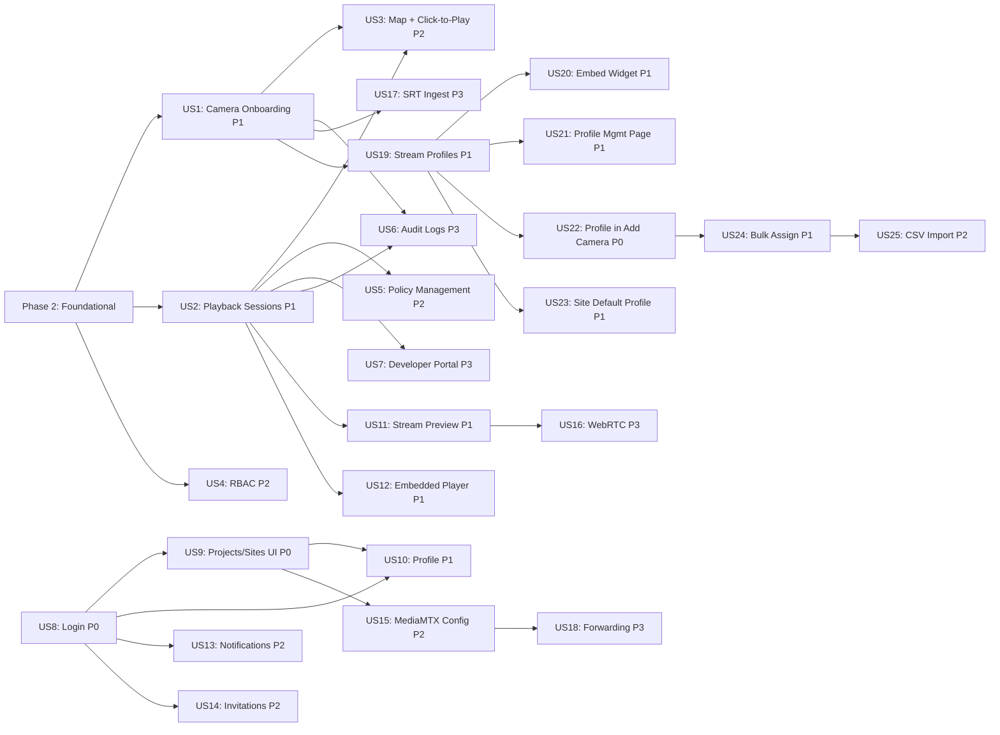

# Tasks: B2B CCTV Streaming Platform

**Input**: Design documents from `/specs/001-cctv-streaming-platform/`
**Prerequisites**: plan.md (required), spec.md (required for user stories), research.md, data-model.md, contracts/

**Tests**: Not explicitly requested in spec. Test tasks omitted. Add via `/speckit.tasks` with TDD flag if needed.

**Organization**: Tasks grouped by user story (from spec.md priorities P1–P3) to enable independent implementation and testing.

## Format: `[ID] [P?] [Story] Description`

- **[P]**: Can run in parallel (different files, no dependencies)
- **[Story]**: Which user story this task belongs to (e.g., US1, US2)
- Include exact file paths in descriptions

## Path Conventions

- **Monorepo**: `apps/*/src/`, `packages/*/src/` at repository root
- Paths follow plan.md structure

---

## Phase 1: Setup (Shared Infrastructure)

**Purpose**: Monorepo initialization, shared packages, Docker dev stack, tooling

- [x] T001 Initialize pnpm workspace with `pnpm-workspace.yaml` listing apps/* and packages/*
- [x] T002 Initialize Turborepo with `turbo.json` defining build/dev/lint/typecheck pipelines
- [x] T003 [P] Create `packages/config/tsconfig/base.json` with strict TypeScript config shared across all packages
- [x] T004 [P] Create `packages/config/eslint/` with shared ESLint flat config for TypeScript
- [x] T005 [P] Create `packages/config/prettier/` with shared Prettier config
- [x] T006 [P] Create `packages/config/tailwind/` with shared Tailwind CSS v4 config
- [x] T007 Initialize `packages/types/` with package.json, tsconfig extending @repo/config, and empty barrel export in `packages/types/src/index.ts`
- [x] T008 [P] Create Zod schemas for Tenant entity in `packages/types/src/tenant.ts` per data-model.md
- [x] T009 [P] Create Zod schemas for Project entity in `packages/types/src/project.ts` per data-model.md
- [x] T010 [P] Create Zod schemas for Site entity in `packages/types/src/site.ts` per data-model.md
- [x] T011 [P] Create Zod schemas for Camera entity in `packages/types/src/camera.ts` per data-model.md
- [x] T012 [P] Create Zod schemas for PlaybackSession entity in `packages/types/src/playback-session.ts` per data-model.md
- [x] T013 [P] Create Zod schemas for Policy entity in `packages/types/src/policy.ts` per data-model.md
- [x] T014 [P] Create Zod schemas for AuditEvent entity in `packages/types/src/audit-event.ts` per data-model.md
- [x] T015 [P] Create Zod schemas for ApiClient entity in `packages/types/src/api-client.ts` per data-model.md
- [x] T016 [P] Create Zod schemas for Stream entity in `packages/types/src/stream.ts` per data-model.md
- [x] T017 Create API envelope schemas (success, error, paginated) in `packages/types/src/api-envelope.ts` per contracts/api-control-openapi.md
- [x] T018 Initialize `packages/ui/` with shadcn/ui using `--preset b2BWMmrjc` and package.json
- [x] T019 [P] Create AppSidebar layout component in `packages/ui/src/layouts/app-sidebar.tsx`
- [x] T020 [P] Create Header component with tenant switcher in `packages/ui/src/layouts/header.tsx`
- [x] T021 [P] Create DataTable wrapper component in `packages/ui/src/data-table/data-table.tsx`
- [x] T022 Scaffold `apps/api-control/` with Hono 4.x, package.json, tsconfig, and hello endpoint in `apps/api-control/src/index.ts`
- [x] T023 Scaffold `apps/console-web/` with Next.js 15 App Router, package.json, tsconfig, tailwind config, and landing page
- [x] T024 Scaffold `apps/data-plane-worker/` with Node.js entry, package.json, tsconfig, and hello endpoint in `apps/data-plane-worker/src/index.ts`
- [x] T025 Initialize `packages/sdk/` with package.json, tsconfig, and empty client stub in `packages/sdk/src/client.ts`
- [x] T026 Create `docker/docker-compose.yml` with PostgreSQL 17, Redis 7, Keycloak 26, MediaMTX 1.x services
- [x] T027 [P] Create `docker/mediamtx/mediamtx.yml` with RTSP + HLS config, API enabled on :9997, metrics on :9998
- [x] T028 [P] Create `docker/keycloak/realm-dev.json` with dev realm, admin user, and client config for console-web + api-control
- [x] T029 [P] Create `docker/postgres/init.sql` with database creation and RLS extension enablement
- [x] T030 Create `docs/versions.md` documenting all pinned versions per research.md R10

**Checkpoint**: `pnpm install && pnpm dev` runs console-web + api-control hello endpoints. `pnpm lint && pnpm typecheck` pass.

---

## Phase 2: Foundational (Blocking Prerequisites)

**Purpose**: Database schema, auth middleware, error handling — MUST complete before user stories

**CRITICAL**: No user story work can begin until this phase is complete

- [x] T031 Create Drizzle ORM config in `apps/api-control/drizzle.config.ts` pointing to PostgreSQL
- [x] T032 Define Drizzle schema for tenants table with RLS in `apps/api-control/src/db/schema/tenants.ts` per data-model.md
- [x] T033 [P] Define Drizzle schema for users table with RLS in `apps/api-control/src/db/schema/users.ts`
- [x] T034 [P] Define Drizzle schema for api_clients table with RLS in `apps/api-control/src/db/schema/api-clients.ts`
- [x] T035 [P] Define Drizzle schema for projects table with RLS in `apps/api-control/src/db/schema/projects.ts`
- [x] T036 [P] Define Drizzle schema for sites table with RLS in `apps/api-control/src/db/schema/sites.ts`
- [x] T037 [P] Define Drizzle schema for cameras table with RLS in `apps/api-control/src/db/schema/cameras.ts`
- [x] T038 [P] Define Drizzle schema for streams table with RLS in `apps/api-control/src/db/schema/streams.ts`
- [x] T039 [P] Define Drizzle schema for playback_sessions table with RLS in `apps/api-control/src/db/schema/playback-sessions.ts`
- [x] T040 [P] Define Drizzle schema for policies table with RLS in `apps/api-control/src/db/schema/policies.ts`
- [x] T041 [P] Define Drizzle schema for audit_events table with RLS in `apps/api-control/src/db/schema/audit-events.ts`
- [x] T042 Create barrel export for all schemas in `apps/api-control/src/db/schema/index.ts`
- [x] T043 Generate initial Drizzle migration via `drizzle-kit generate` *(requires running PostgreSQL — run `pnpm --filter api-control db:migrate`)*
- [x] T044 Create database connection helper with RLS tenant context in `apps/api-control/src/db/client.ts`
- [x] T045 Implement Keycloak OIDC auth middleware in `apps/api-control/src/middleware/auth.ts` (validate Bearer token, extract user/tenant)
- [x] T046 [P] Implement API key auth middleware in `apps/api-control/src/middleware/api-key-auth.ts` (validate X-API-Key header, resolve permissions)
- [x] T047 [P] Implement RBAC middleware in `apps/api-control/src/middleware/rbac.ts` (check role against route requirements)
- [x] T048 [P] Implement tenant RLS middleware in `apps/api-control/src/middleware/tenant-context.ts` (set app.tenant_id on DB connection)
- [x] T049 [P] Implement rate limiting middleware in `apps/api-control/src/middleware/rate-limit.ts` using Redis sliding window
- [x] T050 Implement global error handler middleware in `apps/api-control/src/middleware/error-handler.ts` returning standard error envelope
- [x] T051 Create audit event service in `apps/api-control/src/services/audit.ts` (log events to audit_events table)
- [x] T052 Create seed script with demo tenant, admin user, sample project/site in `apps/api-control/src/db/seed.ts`
- [x] T053 Configure Keycloak OIDC in console-web: NextAuth.js or next-auth with Keycloak provider in `apps/console-web/lib/auth.ts`

**Checkpoint**: Foundation ready — database migrated, auth works, RLS enforced, audit logging functional. User story implementation can begin.

---

## Phase 3: User Story 1 — Camera Onboarding & Health Monitoring (Priority: P1)

**Goal**: Operators can add cameras via console or API, system validates RTSP, shows health status in real time.

**Independent Test**: Add a camera via UI/API, observe health state transition from "connecting" to "online," see thumbnail.

### Implementation for User Story 1

- [x] T054 [P] [US1] Create tenant CRUD routes in `apps/api-control/src/routes/tenants.ts` (POST, GET, PATCH) with Zod validation
- [x] T055 [P] [US1] Create project CRUD routes in `apps/api-control/src/routes/projects.ts` (POST, GET, GET/:id, PATCH, DELETE)
- [x] T056 [P] [US1] Create site CRUD routes in `apps/api-control/src/routes/sites.ts` (POST, GET, GET/:id, PATCH, DELETE)
- [x] T057 [US1] Create camera CRUD routes in `apps/api-control/src/routes/cameras.ts` (POST onboard, GET list, GET/:id, PATCH, DELETE, GET/:id/status, POST/:id/start, POST/:id/stop, POST/bulk)
- [x] T058 [US1] Implement camera onboarding service with RTSP validation trigger in `apps/api-control/src/services/cameras.ts`
- [x] T059 [US1] Implement camera health state machine (connecting→online→degraded→offline→reconnecting→stopped) in `apps/data-plane-worker/src/health/state-machine.ts`
- [x] T060 [US1] Implement flapping detection (>=5 transitions in 2 min → degraded) in `apps/data-plane-worker/src/health/flapping-detector.ts`
- [x] T061 [US1] Create MediaMTX API client (add/remove camera paths, list paths, get config) in `apps/data-plane-worker/src/mediamtx/client.ts`
- [x] T062 [US1] Implement ingest orchestration: assign cameras to MediaMTX paths on onboard, auto-start after RTSP validation in `apps/data-plane-worker/src/ingest/orchestrator.ts`
- [x] T063 [US1] Implement Redis Pub/Sub publisher for camera health updates in `apps/data-plane-worker/src/health/publisher.ts`
- [x] T064 [US1] Implement Redis Pub/Sub subscriber in api-control to update camera health_status and cache in `apps/api-control/src/services/health-subscriber.ts`
- [x] T065 [US1] Implement internal REST endpoints for data-plane-worker in `apps/api-control/src/routes/internal.ts` (assign/unassign/config/nodes)
- [x] T066 [US1] Create console-web dashboard page with summary cards (Card, Badge, Tabs) in `apps/console-web/app/(auth)/dashboard/page.tsx`
- [x] T067 [P] [US1] Create console-web cameras list page with DataTable, filters, pagination in `apps/console-web/app/(auth)/cameras/page.tsx`
- [x] T068 [P] [US1] Create add-camera Dialog with Form (RTSP URL, credentials, name, coordinates, tags) in `apps/console-web/components/cameras/add-camera-dialog.tsx`
- [x] T069 [US1] Create camera detail Sheet with Tabs (Info, Stream Stats) in `apps/console-web/components/cameras/camera-detail-sheet.tsx`
- [x] T070 [US1] Implement API client for console-web to call api-control endpoints in `apps/console-web/lib/api-client.ts`

**Checkpoint**: Camera onboarding works end-to-end. Operator adds camera → status transitions to online → thumbnail visible → health shown in DataTable.

---

## Phase 4: User Story 2 — Secure HLS Playback Session (Priority: P1)

**Goal**: Developers issue signed playback sessions via API, viewers watch HLS with token-gated access, sessions can be refreshed and revoked.

**Independent Test**: Issue session via API → get signed URL → play HLS in browser → let token expire → playback stops with 403.

### Implementation for User Story 2

- [x] T071 [US2] Implement playback session service (issue with HMAC-SHA256 signing, Redis storage, TTL) in `apps/api-control/src/services/playback.ts`
- [x] T072 [US2] Implement session refresh (extend Redis TTL, same URL) in `apps/api-control/src/services/playback.ts`
- [x] T073 [US2] Implement session revocation (delete Redis key, add to replay set) in `apps/api-control/src/services/playback.ts`
- [x] T074 [US2] Implement batch session creation (createMultiple) in `apps/api-control/src/services/playback.ts`
- [x] T075 [US2] Create playback session routes (POST issue, POST batch, POST refresh, POST revoke) in `apps/api-control/src/routes/playback.ts`
- [x] T076 [US2] Implement domain/origin allowlist enforcement in playback session issuance in `apps/api-control/src/services/playback.ts`
- [x] T077 [US2] Implement replay protection check (revoked jti set in Redis) in `apps/api-control/src/services/playback.ts`
- [x] T078 [US2] Implement token validation middleware for HLS origin requests (validate session:{jti} in Redis, check origin) in `apps/data-plane-worker/src/ingest/token-validator.ts`
- [x] T079 [US2] Configure MediaMTX HLS serving with token validation hook (runOnReady / auth webhook) in `docker/mediamtx/mediamtx.yml`
- [x] T080 [US2] Add audit event logging for session.issued, session.refreshed, session.revoked, session.denied in `apps/api-control/src/services/playback.ts`
- [x] T081 [US2] Implement SDK PlaybackClient with createSession, createMultiple, refreshSession, revokeSession in `packages/sdk/src/playback.ts`

**Checkpoint**: Developer can issue a playback session, play HLS in browser, refresh the session, and revocation immediately blocks playback.

---

## Phase 5: User Story 3 — Public Map Viewing with Click-to-Play (Priority: P2)

**Goal**: Public map shows camera pins with thumbnails, click-to-play opens modal with live HLS.

**Independent Test**: Enable map visibility for camera → load public map URL → pin with thumbnail → click → HLS plays in modal.

### Implementation for User Story 3

- [x] T082 [US3] Implement thumbnail worker: FFmpeg keyframe extraction at configurable interval in `apps/data-plane-worker/src/thumbnail/worker.ts`
- [x] T083 [US3] Implement thumbnail cache in Redis and stale-thumbnail fallback in `apps/data-plane-worker/src/thumbnail/cache.ts`
- [x] T084 [US3] Create map pins API route (GET /map/cameras with project_key auth) in `apps/api-control/src/routes/map.ts`
- [x] T085 [US3] Implement viewer-hours quota check (tenant ceiling + optional per-project) in `apps/api-control/src/services/quota.ts`
- [x] T086 [US3] Create public map page with Leaflet, camera pins, status badges in `apps/console-web/app/(public)/map/[projectKey]/page.tsx`
- [x] T087 [US3] Create HoverCard for camera pin (thumbnail preview + status) in `apps/console-web/components/map/camera-pin-hover.tsx`
- [x] T088 [US3] Create click-to-play Dialog with hls.js player in `apps/console-web/components/map/player-dialog.tsx`
- [x] T089 [US3] Integrate playback session auto-issuance on pin click with quota enforcement in `apps/console-web/components/map/player-dialog.tsx`
- [x] T090 [US3] Create admin map page (authenticated, with filters by status/project/site) in `apps/console-web/app/(auth)/map/page.tsx`

**Checkpoint**: Public map shows pins. Click → modal → HLS plays. Quota exceeded → denied gracefully.

---

## Phase 6: User Story 4 — Tenant & RBAC Management (Priority: P2)

**Goal**: Admins create tenants, manage users with roles, RBAC enforced across all endpoints.

**Independent Test**: Create tenant → invite users with different roles → verify each role's access boundaries.

### Implementation for User Story 4

- [x] T091 [US4] Create user management service (invite, role change, list users) in `apps/api-control/src/services/users.ts`
- [x] T092 [US4] Create user management routes in `apps/api-control/src/routes/users.ts`
- [x] T093 [US4] Create API client management service (generate key, list, revoke) in `apps/api-control/src/services/api-clients.ts`
- [x] T094 [US4] Create API client routes in `apps/api-control/src/routes/api-clients.ts`
- [x] T095 [US4] Create tenant settings page in console (Form for name, billing, quotas) in `apps/console-web/app/(auth)/settings/page.tsx`
- [x] T096 [US4] Create user management page with DataTable and role assignment Dialog in `apps/console-web/app/(auth)/settings/users/page.tsx`

**Checkpoint**: Admin creates tenant, assigns roles, RBAC blocks unauthorized actions with 403.

---

## Phase 7: User Story 5 — Playback Policy Management (Priority: P2)

**Goal**: Admins/Developers configure playback policies (TTL, domain allowlist, rate limits) at project or camera level.

**Independent Test**: Create policy with domain allowlist → attach to camera → session from unlisted origin is denied.

### Implementation for User Story 5

- [x] T097 [US5] Create policy service (CRUD, attach to project/camera, resolve effective policy) in `apps/api-control/src/services/policies.ts`
- [x] T098 [US5] Create policy CRUD routes in `apps/api-control/src/routes/policies.ts`
- [x] T099 [US5] Integrate policy resolution into playback session issuance (apply TTL range, domain check, rate limit) in `apps/api-control/src/services/playback.ts`
- [x] T100 [US5] Create policies page with DataTable, create/edit Dialog (Form, Tabs, Switch, Badge for domains) in `apps/console-web/app/(auth)/policies/page.tsx`
- [x] T101 [US5] Create policy form component with TTL config, domain allowlist input, rate limit toggle in `apps/console-web/components/policies/policy-form.tsx`

**Checkpoint**: Policy with domain allowlist attached to camera → sessions from unlisted origin denied with audit log.

---

## Phase 8: User Story 6 — Audit Logs & Usage Reporting (Priority: P3)

**Goal**: Admins view audit logs with filters, see per-tenant usage reports (sessions, viewer-hours, bandwidth).

**Independent Test**: Perform actions → audit entries appear in log viewer with correct details.

### Implementation for User Story 6

- [x] T102 [US6] Create audit events query service with filters (date range, event_type, actor, camera, session, IP) in `apps/api-control/src/services/audit.ts` (extend T051)
- [x] T103 [US6] Create audit events route (GET /audit/events with pagination + filters, POST /audit/events/export) in `apps/api-control/src/routes/audit.ts`
- [x] T104 [US6] Create usage reporting service (sessions issued, viewer-hours from Redis counters, bandwidth estimate) in `apps/api-control/src/services/usage.ts`
- [x] T105 [US6] Create audit page with DataTable, date range picker (Popover+Calendar), type filter (multi-Select), search Input, event detail Sheet in `apps/console-web/app/(auth)/audit/page.tsx`
- [x] T106 [US6] Create export functionality (CSV/JSON) via DropdownMenu + Button in `apps/console-web/components/audit/export-button.tsx`
- [x] T107 [US6] Implement audit data retention: auto-purge events older than 90 days in `apps/api-control/src/services/audit-retention.ts`

**Checkpoint**: Audit page shows events filtered by type/date. Export works. 90-day purge scheduled.

---

## Phase 9: User Story 7 — Developer Portal & SDK (Priority: P3)

**Goal**: Developers generate API keys, read docs, test endpoints, use TypeScript SDK.

**Independent Test**: Developer logs in → generates API key → uses interactive docs to create playback session → SDK snippet works.

### Implementation for User Story 7

- [x] T108 [US7] Create developer portal page with API keys DataTable, generate key Dialog in `apps/console-web/app/(auth)/developer/page.tsx`
- [x] T109 [US7] Create interactive API docs viewer with Tabs (by resource), try-it Form in `apps/console-web/components/developer/api-docs.tsx`
- [x] T110 [US7] Create code snippet components (cURL, TypeScript SDK, fetch) with Tabs in `apps/console-web/components/developer/code-snippets.tsx`
- [x] T111 [US7] Implement SDK base client with auth, error handling, typed responses in `packages/sdk/src/client.ts`
- [x] T112 [P] [US7] Implement SDK CameraClient in `packages/sdk/src/cameras.ts`
- [x] T113 [P] [US7] Implement SDK AuditClient in `packages/sdk/src/audit.ts`
- [x] T114 [US7] Add SDK package.json exports, README, and npm publish config in `packages/sdk/package.json`

**Checkpoint**: Developer can generate API key, use interactive docs, and the SDK createSession call works.

---

## Phase 10: Polish & Cross-Cutting Concerns

**Purpose**: Improvements that affect multiple user stories, production readiness

- [x] T115 [P] Add health check endpoint (GET /health) in `apps/api-control/src/routes/health.ts`
- [x] T116 [P] Add readiness check endpoint (GET /ready) in `apps/api-control/src/routes/health.ts`
- [x] T117 [P] Add Prometheus metrics endpoint (GET /metrics) in `apps/api-control/src/routes/health.ts`
- [x] T118 [P] Add structured JSON logging middleware for all Hono requests in `apps/api-control/src/middleware/logger.ts`
- [x] T119 [P] Add health/ready/metrics endpoints to data-plane-worker in `apps/data-plane-worker/src/index.ts`
- [x] T120 Create Dockerfiles for api-control, console-web, data-plane-worker (multi-stage builds) in `apps/*/Dockerfile`
- [x] T121 [P] Create `docker/docker-compose.prod.yml` with production service definitions
- [x] T122 Generate OpenAPI 3.1 spec from Hono routes using hono-openapi in `apps/api-control/src/openapi.ts`
- [x] T123 Create load test scripts for k6 in `tests/load/` (500-camera ingest, session issuance, HLS origin)
- [x] T124 Create operational runbooks in `docs/runbooks/` (camera mass-offline, ingest failover, Postgres failover, Redis clear, key rotation, tenant onboard/offboard)
- [x] T125 Validate quickstart.md end-to-end (clone → install → dev → onboard → playback → audit)

---

## Phase 11: User Story 8 — Authentication & Login (Priority: P0)

**Goal**: Keycloak OIDC login flow, session management, route protection, logout.

**Independent Test**: Open console → redirected to login → authenticate → see dashboard with identity.

- [x] T126 [US8] Install next-auth v5 (Auth.js) and @auth/core in `apps/console-web/package.json`
- [x] T127 [US8] Create Auth.js config with Keycloak OIDC provider in `apps/console-web/lib/auth-config.ts`
- [x] T128 [US8] Create Auth.js API route handler in `apps/console-web/app/api/auth/[...nextauth]/route.ts`
- [x] T129 [US8] Create login page with "Sign in with Keycloak" button in `apps/console-web/app/(public)/login/page.tsx`
- [x] T130 [US8] Create auth session provider wrapper in `apps/console-web/components/session-provider.tsx`
- [x] T131 [US8] Update root layout to wrap children with SessionProvider in `apps/console-web/app/layout.tsx`
- [x] T132 [US8] Create auth middleware to protect (auth) routes, redirect to /login if unauthenticated in `apps/console-web/middleware.ts`
- [x] T133 [US8] Update sidebar header to show logged-in user name and role from session in `apps/console-web/components/app-sidebar.tsx`
- [x] T134 [US8] Add logout button in sidebar footer, calls signOut() in `apps/console-web/components/app-sidebar.tsx`
- [x] T135 [US8] Update root page to redirect authenticated users to /dashboard, unauthenticated to /login in `apps/console-web/app/page.tsx`

**Checkpoint**: Unauthenticated → login page → Keycloak auth → dashboard with user identity. Logout works.

---

## Phase 12: User Story 9 — Project & Site Management UI (Priority: P0)

**Goal**: Console pages for CRUD on projects and sites with hierarchical navigation.

**Independent Test**: Create project → create site → see hierarchy → cameras listed under site.

- [x] T136 [P] [US9] Create projects list page with DataTable, create dialog in `apps/console-web/app/(auth)/projects/page.tsx`
- [x] T137 [P] [US9] Create project detail page with sites list, edit/delete actions in `apps/console-web/app/(auth)/projects/[id]/page.tsx`
- [x] T138 [US9] Create site create/edit dialog component in `apps/console-web/components/sites/site-dialog.tsx`
- [x] T139 [US9] Create site detail page with cameras list, map pin preview in `apps/console-web/app/(auth)/sites/[id]/page.tsx`
- [x] T140 [US9] Add breadcrumb navigation component (Projects > Project Name > Sites > Site Name) in `apps/console-web/components/breadcrumb-nav.tsx`
- [x] T141 [US9] Update sidebar to add Projects link under Monitoring section in `apps/console-web/components/app-sidebar.tsx`
- [x] T142 [US9] Update camera onboarding to use project/site selector (dropdown) in `apps/console-web/components/cameras/add-camera-dialog.tsx`
- [x] T143 [US9] Add delete protection: warn when deleting site with cameras in `apps/api-control/src/routes/sites.ts`

**Checkpoint**: Full project/site hierarchy management. Cannot delete site with cameras.

---

## Phase 13: User Story 10 — User Profile & Account Settings (Priority: P1)

**Goal**: Profile page for name, email, password, MFA management.

**Independent Test**: Login → profile → change name → see update reflected.

- [x] T144 [US10] Create profile page with name, email, role (read-only), MFA status, last login in `apps/console-web/app/(auth)/profile/page.tsx`
- [x] T145 [US10] Create profile update API endpoint (PATCH /api/v1/users/me) in `apps/api-control/src/routes/users.ts`
- [x] T146 [US10] Create password change form component in `apps/console-web/components/profile/change-password.tsx`
- [x] T147 [US10] Create MFA toggle component (enable/disable with QR code flow) in `apps/console-web/components/profile/mfa-toggle.tsx`
- [x] T148 [US10] Add profile link in sidebar user menu (bottom of sidebar) in `apps/console-web/components/app-sidebar.tsx`

**Checkpoint**: User can view and edit profile. Password change and MFA toggle work.

---

## Phase 14: User Story 11 — Stream Preview in Camera Detail (Priority: P1)

**Goal**: Inline HLS preview in camera detail panel.

**Independent Test**: Open camera detail → live stream plays → close panel → session revoked.

- [x] T149 [US11] Create HLS player component using hls.js in `apps/console-web/components/player/hls-player.tsx`
- [x] T150 [US11] Integrate HLS player into camera detail sheet with auto-session issuance in `apps/console-web/components/cameras/camera-detail-sheet.tsx`
- [x] T151 [US11] Add session auto-revoke on panel close and offline fallback (last thumbnail + overlay) in `apps/console-web/components/cameras/camera-detail-sheet.tsx`

**Checkpoint**: Camera detail shows live preview for online cameras, thumbnail for offline.

---

## Phase 15: User Story 12 — Embedded HLS Player Page (Priority: P1)

**Goal**: Standalone player page at /play for developer testing.

**Independent Test**: Issue session via API → open /play?token=xxx → stream plays.

- [x] T152 [US12] Create public player page with hls.js, token param validation in `apps/console-web/app/(public)/play/page.tsx`
- [x] T153 [US12] Add expired/invalid token error states and developer-friendly messages in `apps/console-web/app/(public)/play/page.tsx`
- [x] T154 [US12] Add "Open in Player" button to developer portal code snippets in `apps/console-web/components/developer/code-snippets.tsx`

**Checkpoint**: /play?token=xxx plays stream. Expired token shows clear error.

---

## Phase 16: User Story 13 — Real-Time Alert Notifications (Priority: P2)

**Goal**: Bell icon + badge + dropdown with real-time notifications via SSE.

**Independent Test**: Camera goes offline → badge appears within 10s → click to see details.

- [x] T155 [US13] Define Drizzle schema for notifications table in `apps/api-control/src/db/schema/notifications.ts`
- [x] T156 [US13] Create notification service (create, list, markRead, markAllRead) in `apps/api-control/src/services/notifications.ts`
- [x] T157 [US13] Create notification routes (GET list, POST read, POST read-all) in `apps/api-control/src/routes/notifications.ts`
- [x] T158 [US13] Create SSE endpoint for real-time push in `apps/api-control/src/routes/notifications.ts`
- [x] T159 [US13] Integrate notification creation into health-subscriber (camera offline/degraded events) in `apps/api-control/src/services/health-subscriber.ts`
- [x] T160 [US13] Create notification bell component with badge count and dropdown in `apps/console-web/components/notifications/notification-bell.tsx`
- [x] T161 [US13] Add SSE client hook for real-time notification updates in `apps/console-web/hooks/use-notifications.ts`
- [x] T162 [US13] Add notification bell to auth layout header in `apps/console-web/app/(auth)/layout.tsx`

**Checkpoint**: Camera offline → bell badge → click → see notification → click-through to camera.

---

## Phase 17: User Story 14 — User Invitation Flow (Priority: P2)

**Goal**: Email invitation with 48h expiry, accept flow, pending status.

**Independent Test**: Admin invites → user receives link → accepts → can login.

- [x] T163 [US14] Define Drizzle schema for invitations table in `apps/api-control/src/db/schema/invitations.ts`
- [x] T164 [US14] Create invitation service (invite, validate, accept, expire) in `apps/api-control/src/services/invitations.ts`
- [x] T165 [US14] Create invitation routes (POST invite, GET validate, POST accept) in `apps/api-control/src/routes/invitations.ts`
- [x] T166 [US14] Create invitation acceptance page in `apps/console-web/app/(public)/invite/[token]/page.tsx`
- [x] T167 [US14] Update users page to show "Pending" badge for invited users and "Invite User" dialog in `apps/console-web/app/(auth)/settings/users/page.tsx`

**Checkpoint**: Admin invites → pending shown → user accepts via link → can login with role.

---

## Phase 18: User Story 15 — MediaMTX Configuration UI (Priority: P2)

**Goal**: Console page to view/edit MediaMTX config via Control API.

**Independent Test**: View config → change HLS segment duration → applied without interrupting streams.

- [x] T168 [US15] Create MediaMTX config service (getConfig, updateConfig, listPaths) in `apps/api-control/src/services/mediamtx-config.ts`
- [x] T169 [US15] Create MediaMTX config routes in `apps/api-control/src/routes/mediamtx.ts`
- [x] T170 [US15] Create MediaMTX config page with structured form in `apps/console-web/app/(auth)/settings/mediamtx/page.tsx`
- [x] T171 [US15] Add MediaMTX link under Settings in sidebar in `apps/console-web/components/app-sidebar.tsx`

**Checkpoint**: View MediaMTX config → edit → save → hot-reload applied.

---

## Phase 19: User Story 16 — WebRTC Low-Latency Viewer (Priority: P3)

**Goal**: Optional WebRTC playback with HLS fallback.

- [x] T172 [US16] Create WebRTC player component using MediaMTX WebRTC endpoint in `apps/console-web/components/player/webrtc-player.tsx`
- [x] T173 [US16] Create unified player component with HLS/WebRTC toggle and auto-fallback in `apps/console-web/components/player/unified-player.tsx`
- [x] T174 [US16] Replace hls-player usage in camera detail and map player with unified-player in `apps/console-web/components/cameras/camera-detail-sheet.tsx`

**Checkpoint**: Toggle "Low Latency" → WebRTC < 1s. Fallback to HLS if blocked.

---

## Phase 20: User Story 17 — SRT Ingest Support (Priority: P3)

**Goal**: Support SRT URLs in camera onboarding.

- [x] T175 [US17] Update camera onboarding form to accept srt:// URLs with validation in `apps/console-web/components/cameras/add-camera-dialog.tsx`
- [x] T176 [US17] Update camera service to handle SRT source config for MediaMTX in `apps/api-control/src/services/cameras.ts`
- [x] T177 [US17] Update MediaMTX client to configure SRT source paths in `apps/data-plane-worker/src/mediamtx/client.ts`

**Checkpoint**: Onboard camera with srt:// URL → ingests → produces HLS.

---

## Phase 21: User Story 18 — Stream Forwarding to CDN (Priority: P3)

**Goal**: Push streams to external endpoints.

- [x] T178 [US18] Create stream forwarding service (CRUD forwarding rules) in `apps/api-control/src/services/forwarding.ts`
- [x] T179 [US18] Create forwarding routes in `apps/api-control/src/routes/forwarding.ts`
- [x] T180 [US18] Create forwarding rules page with DataTable and create dialog in `apps/console-web/app/(auth)/settings/forwarding/page.tsx`
- [x] T181 [US18] Integrate forwarding with MediaMTX runOnReady hook in `apps/data-plane-worker/src/ingest/orchestrator.ts`

**Checkpoint**: Add forwarding rule → stream pushed to external RTMP URL.

---

## Phase 22: User Story 19 — Stream Output Profiles (Priority: P1)

**Goal**: Reusable stream profiles (protocol, audio, framerate) assignable to cameras.

**Independent Test**: Create profile "Public Embed" (HLS, no audio, 15fps) → assign to camera → output matches settings.

- [x] T182 [US19] Define Drizzle schema for stream_profiles table (id, tenant_id, name, description, output_protocol enum hls/webrtc/both, audio_mode enum include/strip/mute, max_framerate int default 0, is_default bool, version int, timestamps) in `apps/api-control/src/db/schema/stream-profiles.ts`
- [x] T183 [US19] Update schema barrel export to include stream_profiles in `apps/api-control/src/db/schema/index.ts`
- [x] T184 [US19] Create Zod schemas for StreamProfile entity (create/update input schemas) in `packages/types/src/stream-profile.ts`
- [x] T185 [US19] Create stream profile service (CRUD, getDefault, assignToCamera, getEffectiveProfile, propagateChanges) in `apps/api-control/src/services/stream-profiles.ts`
- [x] T186 [US19] Create stream profile routes (POST, GET list, GET/:id, PATCH, DELETE, POST/:id/clone, GET/:id/cameras) in `apps/api-control/src/routes/stream-profiles.ts`
- [x] T187 [US19] Add profile_id FK to cameras table schema in `apps/api-control/src/db/schema/cameras.ts`
- [x] T188 [US19] Update camera service to resolve effective profile (camera.profile_id → tenant default) in `apps/api-control/src/services/cameras.ts`
- [x] T189 [US19] Update ingest orchestrator to apply profile settings (audio strip via FFmpeg -an, framerate cap via -r) when configuring MediaMTX path in `apps/data-plane-worker/src/ingest/orchestrator.ts`
- [x] T190 [US19] Create seed for Default profile per tenant in `apps/api-control/src/db/seed.ts`
- [x] T191 [US19] Mount stream-profiles routes in api-control in `apps/api-control/src/index.ts`

**Checkpoint**: Create profile → assign to camera → stream output matches profile settings.

---

## Phase 23: User Story 21 — Stream Profile Management Page (Priority: P1)

**Goal**: Console page for managing stream profiles.

**Independent Test**: Create profile → see in list → edit → clone → assign cameras → delete.

- [x] T192 [P] [US21] Create Stream Profiles list page with DataTable, create dialog, empty state in `apps/console-web/app/(auth)/profiles/page.tsx`
- [x] T193 [US21] Create profile create/edit form dialog (name, description, protocol Select, audio mode Select, framerate Input with transcoding warning) in `apps/console-web/components/profiles/profile-form-dialog.tsx`
- [x] T194 [US21] Create profile detail page showing assigned cameras list in `apps/console-web/app/(auth)/profiles/[id]/page.tsx`
- [x] T195 [US21] Add "Assign Profile" dropdown to camera detail sheet and cameras table actions in `apps/console-web/app/(auth)/cameras/page.tsx`
- [x] T196 [US21] Add "Stream Profiles" link in sidebar under Management section in `apps/console-web/components/app-sidebar.tsx`
- [x] T197 [US21] Add api-client methods: listProfiles, getProfile, createProfile, updateProfile, deleteProfile, cloneProfile, assignProfileToCamera in `apps/console-web/lib/api-client.ts`

**Checkpoint**: Full profile CRUD in console. Assign profile to camera. Default profile exists.

---

## Phase 24: User Story 20 — Embeddable Player Widget (Priority: P1)

**Goal**: `<iframe>` embed snippet for B2B developers.

**Independent Test**: Generate embed code → paste into external page → stream plays with profile settings.

- [x] T198 [US20] Create public embed page at `/embed/[cameraId]/page.tsx` that accepts `key` query param, auto-issues session, plays HLS/WebRTC based on camera profile in `apps/console-web/app/(public)/embed/[cameraId]/page.tsx`
- [x] T199 [US20] Create embed error states (domain blocked, expired, offline, invalid key) with branded error screens in `apps/console-web/app/(public)/embed/[cameraId]/page.tsx`
- [x] T200 [US20] Create "Get Embed Code" dialog component showing copyable iframe/script snippets in `apps/console-web/components/cameras/embed-code-dialog.tsx`
- [x] T201 [US20] Add "Get Embed Code" button to camera detail sheet in `apps/console-web/components/cameras/camera-detail-sheet.tsx`
- [x] T202 [US20] Add embed code section to developer portal with examples in `apps/console-web/app/(auth)/developer/page.tsx`
- [x] T203 [US20] Update playback session service to accept API key auth for embed-originated requests (validate key + domain) in `apps/api-control/src/services/playback.ts`
- [x] T204 [US20] Add `/embed` to public routes in auth middleware (no login required) in `apps/console-web/middleware.ts`

**Checkpoint**: Embed snippet → paste in external page → stream plays. Domain policy enforced.

---

## Phase 25: User Story 22 — Profile Selection at Camera Onboarding (Priority: P0)

**Goal**: Add Camera form includes Stream Profile dropdown with site-default pre-selection.

**Independent Test**: Add camera with "Public Embed" profile → stream output matches profile.

- [x] T205 [US22] Add Stream Profile dropdown (Select) to Add Camera dialog, fetch profiles on mount, pre-select site default in `apps/console-web/components/cameras/add-camera-dialog.tsx`
- [x] T206 [US22] Pass `profile_id` in createCamera API call body in `apps/console-web/components/cameras/add-camera-dialog.tsx`
- [x] T207 [US22] Update camera onboarding API to accept `profile_id` field and store it in `apps/api-control/src/routes/cameras.ts`

**Checkpoint**: Add camera → profile dropdown shows → selected profile applied on create.

---

## Phase 26: User Story 23 — Site-Level Default Profile (Priority: P1)

**Goal**: Sites have a default profile. New cameras inherit it. "Apply to All" updates existing cameras.

**Independent Test**: Set site default to "Public Embed" → add camera → auto-assigned.

- [x] T208 [US23] Add `default_profile_id` uuid FK column to sites table schema in `apps/api-control/src/db/schema/sites.ts`
- [x] T209 [US23] Update site CRUD routes to accept and return `default_profile_id` in `apps/api-control/src/routes/sites.ts`
- [x] T210 [US23] Create "Apply Profile to All Cameras" endpoint: POST /sites/:id/apply-profile that updates all cameras in the site in `apps/api-control/src/routes/sites.ts`
- [x] T211 [US23] Add Default Profile Select dropdown to Site detail page in `apps/console-web/app/(auth)/sites/[id]/page.tsx`
- [x] T212 [US23] Add "Apply to All Cameras" button on Site detail page that calls the endpoint and shows toast in `apps/console-web/app/(auth)/sites/[id]/page.tsx`
- [x] T213 [US23] Update Add Camera dialog: when site is selected, fetch site's default_profile_id and pre-select in profile dropdown in `apps/console-web/components/cameras/add-camera-dialog.tsx`

**Checkpoint**: Set site default → add camera → auto-assigned. Apply to All → all cameras updated.

---

## Phase 27: User Story 24 — Bulk Profile Assignment (Priority: P1)

**Goal**: Multi-select cameras with checkboxes → bulk assign profile.

**Independent Test**: Select 10 cameras → Assign Profile → all 10 updated.

- [x] T214 [US24] Add checkbox column and selection state (selectedIds Set) to Cameras page in `apps/console-web/app/(auth)/cameras/page.tsx`
- [x] T215 [US24] Add bulk action toolbar (appears when selection > 0) with "Assign Profile", "Start All", "Stop All" buttons in `apps/console-web/app/(auth)/cameras/page.tsx`
- [x] T216 [US24] Create bulk assign profile dialog: Select profile → confirm → call API for each selected camera in `apps/console-web/components/cameras/bulk-assign-dialog.tsx`
- [x] T217 [US24] Create bulk assign API endpoint: POST /cameras/bulk-assign-profile { camera_ids[], profile_id } in `apps/api-control/src/routes/cameras.ts`

**Checkpoint**: Select cameras → bulk assign → all updated → toast shows count.

---

## Phase 28: User Story 25 — Smart CSV Import (Priority: P2)

**Goal**: Drag-drop CSV → auto-detect mode → editable preview → per-row profile → import.

**Independent Test**: Drop CSV with 15 cameras → preview → edit 2 profiles → import 13.

- [x] T218 [US25] Create CSV drop zone component with drag-and-drop + file picker in `apps/console-web/components/cameras/csv-drop-zone.tsx`
- [x] T219 [US25] Create CSV parser utility: read file, detect columns, determine mode (add-cameras vs assign-profiles), parse rows in `apps/console-web/lib/csv-parser.ts`
- [x] T220 [US25] Create CSV import preview dialog with editable table, per-row profile dropdown, bulk "Apply to all" dropdown, inline validation (warning icons for missing fields), import/skip counters in `apps/console-web/components/cameras/csv-import-dialog.tsx`
- [x] T221 [US25] Create CSV import summary dialog showing imported/skipped/error counts after import in `apps/console-web/components/cameras/csv-import-dialog.tsx`
- [x] T222 [US25] Add CSV drop zone to Cameras page (below header, above table) with "Import CSV" button in `apps/console-web/app/(auth)/cameras/page.tsx`
- [x] T223 [US25] Create bulk camera import API endpoint: POST /cameras/import { cameras[] } that creates multiple cameras in one call in `apps/api-control/src/routes/cameras.ts`
- [x] T224 [US25] Create bulk profile assign by name API endpoint: POST /cameras/import-profiles { mappings: [{camera_name, profile_name}] } that matches and assigns in `apps/api-control/src/routes/cameras.ts`
- [x] T225 [US25] Add "Assign Cameras from CSV" button on Profile Detail page linking to Cameras page with pre-selected profile in `apps/console-web/app/(auth)/profiles/[id]/page.tsx`

**Checkpoint**: Drop CSV → preview → edit → import → summary shows results.

---

## Phase 29: User Story 26 — Feature Gating & Subscription Plans (Priority: P0-Commercial)

**Goal**: Enforce feature limits per tenant plan. On-Prem = all unlocked.

- [x] T226 [US26] Define Drizzle schema for subscription_plans table (id, name, max_cameras, max_projects, max_users, viewer_hours_quota, audit_retention_days, features jsonb, price_cents, billing_interval) in `apps/api-control/src/db/schema/subscription-plans.ts`
- [x] T227 [US26] Add subscription_plan_id FK to tenants table and plan-related fields in `apps/api-control/src/db/schema/tenants.ts`
- [x] T228 [US26] Create feature gate service (checkLimit, checkFeatureFlag, getUsage, getPlanLimits) in `apps/api-control/src/services/feature-gate.ts`
- [x] T229 [US26] Create feature gate middleware that checks plan limits before resource creation in `apps/api-control/src/middleware/feature-gate.ts`
- [x] T230 [US26] Seed default plans (Free/Starter/Pro/Enterprise) in `apps/api-control/src/db/seed.ts`
- [x] T231 [US26] Create plan management admin routes (GET plans, GET plan/:id) in `apps/api-control/src/routes/plans.ts`
- [x] T232 [US26] Create upgrade prompt component (shows when limit reached) in `apps/console-web/components/upgrade-prompt.tsx`
- [x] T233 [US26] Create feature-locked page wrapper (shows lock icon + upgrade CTA for gated features) in `apps/console-web/components/feature-gate.tsx`
- [x] T234 [US26] Update schema barrel export and mount routes in `apps/api-control/src/db/schema/index.ts` and `apps/api-control/src/index.ts`

**Checkpoint**: Free plan tenant blocked at 5 cameras with upgrade prompt. Enterprise tenant unlimited.

---

## Phase 30: User Story 27 — License Key System (Priority: P0-Commercial)

**Goal**: On-Prem license validation with encoded limits and grace period.

- [x] T235 [US27] Create license key validation service (decode, verify HMAC, check expiry, check limits) in `apps/api-control/src/services/license.ts`
- [x] T236 [US27] Create license key middleware (validate on startup, periodic check) in `apps/api-control/src/middleware/license.ts`
- [x] T237 [US27] Create license settings page (enter key, view details, expiry warning) in `apps/console-web/app/(auth)/settings/license/page.tsx`
- [x] T238 [US27] Create license API routes (POST activate, GET status) in `apps/api-control/src/routes/license.ts`
- [x] T239 [US27] Add sidebar link for License under Platform section in `apps/console-web/components/app-sidebar.tsx`

**Checkpoint**: No license = trial mode (5 cameras, 30 days). Valid license unlocks limits.

---

## Phase 31: User Story 28 — Billing & Usage Metering (Priority: P0-Commercial)

**Goal**: Pluggable billing with Stripe default, usage tracking, manual payment support.

- [x] T240 [US28] Define payment adapter interface (createCheckout, handleWebhook, getStatus, cancel) in `apps/api-control/src/services/billing/adapter.ts`
- [x] T241 [US28] Implement Stripe payment adapter in `apps/api-control/src/services/billing/stripe-adapter.ts`
- [x] T242 [US28] Implement manual payment adapter (admin marks payment received) in `apps/api-control/src/services/billing/manual-adapter.ts`
- [x] T243 [US28] Create billing service (selectAdapter, createSubscription, handlePayment, getInvoices) in `apps/api-control/src/services/billing/index.ts`
- [x] T244 [US28] Define Drizzle schema for billing tables (invoices, payments, payment_methods) in `apps/api-control/src/db/schema/billing.ts`
- [x] T245 [US28] Create billing routes (GET usage, POST checkout, POST webhook, GET invoices, POST mark-paid) in `apps/api-control/src/routes/billing.ts`
- [x] T246 [US28] Create billing page (current plan, usage meters, upgrade button, invoice history) in `apps/console-web/app/(auth)/billing/page.tsx`
- [x] T247 [US28] Create usage meter components (cameras, viewer-hours, egress progress bars) in `apps/console-web/components/billing/usage-meters.tsx`
- [x] T248 [US28] Add Billing link in sidebar in `apps/console-web/components/app-sidebar.tsx`

**Checkpoint**: View usage → upgrade → Stripe checkout (or manual payment).

---

## Phase 32: User Story 29 — Tenant Self-Registration (Priority: P0-Commercial)

**Goal**: Public signup → email verify → create tenant → choose plan.

- [x] T249 [US29] Create registration page (email, password, tenant name) in `apps/console-web/app/(public)/register/page.tsx`
- [x] T250 [US29] Create registration API (POST /auth/register) that creates pending tenant + sends verification email in `apps/api-control/src/routes/auth.ts`
- [x] T251 [US29] Create email verification page at /verify/[token] in `apps/console-web/app/(public)/verify/[token]/page.tsx`
- [x] T252 [US29] Create verification API (POST /auth/verify) that activates tenant in `apps/api-control/src/routes/auth.ts`
- [x] T253 [US29] Add "Sign up" link on login page in `apps/console-web/app/(public)/login/page.tsx`
- [x] T254 [US29] Add /register and /verify to public routes in middleware in `apps/console-web/middleware.ts`

**Checkpoint**: Register → verify email → login → new tenant on Free plan.

---

## Phase 33: User Story 30 — Onboarding Wizard (Priority: P0-Commercial)

**Goal**: Step-by-step wizard for first-time users.

- [x] T255 [US30] Create onboarding wizard modal component (Welcome → Project → Site → Camera → Verify → Done) in `apps/console-web/components/onboarding/wizard.tsx`
- [x] T256 [US30] Create onboarding progress tracker (step indicator, skip, resume) in `apps/console-web/components/onboarding/progress.tsx`
- [x] T257 [US30] Store onboarding progress in tenant metadata (add onboarding_completed boolean to tenants) in `apps/api-control/src/db/schema/tenants.ts`
- [x] T258 [US30] Create onboarding API (GET /onboarding/status, POST /onboarding/complete, POST /onboarding/skip) in `apps/api-control/src/routes/onboarding.ts`
- [x] T259 [US30] Show wizard on dashboard if onboarding not completed, show "Complete Setup" banner if skipped in `apps/console-web/app/(auth)/dashboard/page.tsx`

**Checkpoint**: First login → wizard → create project/site/camera → stream verified → done.

---

## Phase 34: User Story 31 — Email Service (Priority: P0-Commercial)

**Goal**: Configurable email provider (SMTP/SendGrid/SES).

- [x] T260 [P] [US31] Create email provider interface (send, sendTemplate) in `apps/api-control/src/services/email/provider.ts`
- [x] T261 [P] [US31] Implement SMTP email provider in `apps/api-control/src/services/email/smtp-provider.ts`
- [x] T262 [P] [US31] Implement SendGrid email provider in `apps/api-control/src/services/email/sendgrid-provider.ts`
- [x] T263 [US31] Create email service (selectProvider, sendInvitation, sendVerification, sendPasswordReset, sendAlert, sendReceipt) in `apps/api-control/src/services/email/index.ts`
- [x] T264 [US31] Create email templates (HTML) for each email type in `apps/api-control/src/services/email/templates/`
- [x] T265 [US31] Create email settings page (configure SMTP/SendGrid, test email) in `apps/console-web/app/(auth)/settings/email/page.tsx`
- [x] T266 [US31] Add Email link in sidebar under Platform section in `apps/console-web/components/app-sidebar.tsx`

**Checkpoint**: Configure SMTP → send test email → invitation emails work.

---

## Phase 35: User Story 32 — Webhook System (Priority: P1-Commercial)

**Goal**: Tenant webhook URLs with event selection, HMAC signature, retry.

- [x] T267 [US32] Define Drizzle schema for webhooks and webhook_deliveries tables in `apps/api-control/src/db/schema/webhooks.ts`
- [x] T268 [US32] Create webhook service (register, unregister, deliver with HMAC, retry logic) in `apps/api-control/src/services/webhooks.ts`
- [x] T269 [US32] Create webhook routes (CRUD + test delivery) in `apps/api-control/src/routes/webhooks.ts`
- [x] T270 [US32] Integrate webhook delivery into health-subscriber (camera events) and playback service (session events) in `apps/api-control/src/services/health-subscriber.ts`
- [x] T271 [US32] Create webhooks management page (DataTable, add dialog, delivery logs) in `apps/console-web/app/(auth)/settings/webhooks/page.tsx`
- [x] T272 [US32] Add Webhooks link in sidebar in `apps/console-web/components/app-sidebar.tsx`

**Checkpoint**: Register webhook → camera goes offline → webhook fires within 30s with HMAC.

---

## Phase 36: User Story 33 — Data Export & GDPR (Priority: P1-Commercial)

**Goal**: Full data export + tenant deletion.

- [x] T273 [US33] Create data export service (generate archive job, zip cameras/projects/sites/audit/configs as JSON+CSV) in `apps/api-control/src/services/data-export.ts`
- [x] T274 [US33] Create tenant deletion service (cascade delete all data, confirmation flow) in `apps/api-control/src/services/tenant-deletion.ts`
- [x] T275 [US33] Create export/delete routes (POST /export, POST /delete-tenant) in `apps/api-control/src/routes/data-management.ts`
- [x] T276 [US33] Create data management page (Export button, Delete tenant with confirmation) in `apps/console-web/app/(auth)/settings/data/page.tsx`

**Checkpoint**: Export → download ZIP. Delete tenant → all data removed.

---

## Phase 37: User Story 34 — API Rate Limit Dashboard (Priority: P1-Commercial)

**Goal**: Developer usage charts and quota visibility.

- [x] T277 [US34] Create rate limit analytics service (aggregate from Redis counters) in `apps/api-control/src/services/rate-analytics.ts`
- [x] T278 [US34] Create rate limit analytics route (GET /developer/usage) in `apps/api-control/src/routes/developer.ts`
- [x] T279 [US34] Create usage dashboard tab in developer portal (req/min chart, top endpoints, remaining quota) in `apps/console-web/app/(auth)/developer/page.tsx`

**Checkpoint**: Developer sees usage chart + rate limit status.

---

## Phase 38: User Story 35 — Error Recovery & Resilience (Priority: P1-Commercial)

**Goal**: Circuit breakers, graceful degradation, graceful shutdown.

- [x] T280 [P] [US35] Create circuit breaker utility (open/half-open/closed states) in `apps/api-control/src/lib/circuit-breaker.ts`
- [x] T281 [P] [US35] Create cache fallback wrapper (serve stale on DB failure) in `apps/api-control/src/lib/cache-fallback.ts`
- [x] T282 [US35] Add graceful shutdown handler (complete in-flight, close DB/Redis, SIGTERM) in `apps/api-control/src/index.ts`
- [x] T283 [US35] Update health endpoints to report component-level status (db, redis, mediamtx) in `apps/api-control/src/routes/health.ts`
- [x] T284 [US35] Add degraded-mode banner component in console when services are unhealthy in `apps/console-web/components/degraded-banner.tsx`

**Checkpoint**: Kill MediaMTX → dashboard shows "Stream Engine: Degraded" banner. Restart → auto-recovers.

---

## Phase 39: User Story 36 — Documentation Site (Priority: P1-Commercial)

**Goal**: Dedicated docs with API ref, guides, search.

- [x] T285 [US36] Create docs app scaffold (static site or Next.js) in `apps/docs/`
- [x] T286 [US36] Create API reference page (auto-generated from OpenAPI spec) in `apps/docs/`
- [x] T287 [US36] Create user guide pages (setup, cameras, profiles, policies, embed) in `apps/docs/`
- [x] T288 [US36] Create deployment guide pages (On-Prem HCI, SaaS, Docker) in `apps/docs/`
- [x] T289 [US36] Add docs link in console sidebar and header in `apps/console-web/components/app-sidebar.tsx`

**Checkpoint**: Visit /docs → see API reference + guides + search.

---

## Phase 40: User Story 37 — Recording/VOD (Priority: P2-Commercial)

**Goal**: Per-camera recording with VOD playback.

- [x] T290 [US37] Define Drizzle schema for recordings table (id, camera_id, start_time, end_time, file_path, size_bytes, retention_days) in `apps/api-control/src/db/schema/recordings.ts`
- [x] T291 [US37] Create recording service (enable/disable per camera, configure retention, list recordings) in `apps/api-control/src/services/recordings.ts`
- [x] T292 [US37] Create recording routes (CRUD + VOD playback session) in `apps/api-control/src/routes/recordings.ts`
- [x] T293 [US37] Configure MediaMTX recording (fMP4 format, retention) via data-plane-worker in `apps/data-plane-worker/src/ingest/orchestrator.ts`
- [x] T294 [US37] Create recordings page with timeline browser and VOD player in `apps/console-web/app/(auth)/recordings/page.tsx`
- [x] T295 [US37] Add Recordings link in sidebar under Monitoring in `apps/console-web/components/app-sidebar.tsx`

**Checkpoint**: Enable recording → camera records → browse timeline → play VOD.

---

## Phase 41: User Story 38 — AI Analytics Hooks (Priority: P2-Commercial)

**Goal**: Integration endpoints for third-party AI services.

- [x] T296 [US38] Define Drizzle schema for ai_integrations and ai_events tables in `apps/api-control/src/db/schema/ai-integrations.ts`
- [x] T297 [US38] Create AI integration service (configure endpoint, send snapshots, store results) in `apps/api-control/src/services/ai-integrations.ts`
- [x] T298 [US38] Create AI integration routes (CRUD integrations, GET events) in `apps/api-control/src/routes/ai-integrations.ts`
- [x] T299 [US38] Create snapshot sender in data-plane-worker (periodic capture + POST to AI endpoint) in `apps/data-plane-worker/src/ai/snapshot-sender.ts`
- [x] T300 [US38] Create AI integrations settings page in `apps/console-web/app/(auth)/settings/ai/page.tsx`
- [x] T301 [US38] Add AI Integrations link in sidebar in `apps/console-web/components/app-sidebar.tsx`

**Checkpoint**: Configure AI endpoint → snapshots sent → events logged.

---

## Dependencies & Execution Order (Updated)

### Phase Dependencies

- **Setup (Phase 1)**: No dependencies — can start immediately
- **Foundational (Phase 2)**: Depends on Setup completion — BLOCKS all user stories
- **US1 (Phase 3)**: Depends on Foundational — Camera onboarding + health
- **US2 (Phase 4)**: Depends on Foundational — Playback sessions (can parallelize with US1)
- **US3 (Phase 5)**: Depends on US1 (cameras) + US2 (sessions) — Map + click-to-play
- **US4 (Phase 6)**: Depends on Foundational — RBAC (can parallelize with US1/US2)
- **US5 (Phase 7)**: Depends on US2 — Policy management
- **US6 (Phase 8)**: Depends on US1 + US2 — Audit logs (requires events to exist)
- **US7 (Phase 9)**: Depends on US2 — Developer portal + SDK
- **Polish (Phase 10)**: Depends on all desired user stories being complete

### User Story Dependencies

### Parallel Opportunities

**After Foundation completes, these can run in parallel:**
- US1 (Camera Onboarding) + US2 (Playback Sessions) + US4 (RBAC)

**After US1 + US2 complete:**
- US3 (Map) + US5 (Policies) + US6 (Audit) + US7 (SDK)

**New feature phases — after existing MVP:**
- US8 (Login) — do first, no dependencies on new features
- After US8: US9 (Projects/Sites UI) + US13 (Notifications) + US14 (Invitations) in parallel
- After US9: US10 (Profile) + US15 (MediaMTX Config)
- US11 (Preview) + US12 (Player) — can start anytime after US2
- US16 (WebRTC) + US17 (SRT) + US18 (Forwarding) — P3, do last

### Within Each User Story

- Models/schemas before services
- Services before routes
- API routes before console UI pages
- Core implementation before integration with other stories

---

## Implementation Strategy

### MVP First (US1 + US2)

1. Complete Phase 1: Setup
2. Complete Phase 2: Foundational (CRITICAL)
3. Complete Phase 3: US1 — Camera Onboarding
4. Complete Phase 4: US2 — Playback Sessions
5. **STOP and VALIDATE**: Test camera onboard → session → HLS playback
6. This is the minimum viable product

### Incremental Delivery

1. Setup + Foundational → Foundation ready
2. US1 + US2 → Test independently → **MVP!**
3. US3 (Map) → Public-facing demo
4. US4 (RBAC) + US5 (Policies) → Production-ready security
5. US6 (Audit) + US7 (SDK) → Enterprise features
6. Polish → Production deployment

### Parallel Team Strategy

With 2–3 developers:
1. Team completes Setup + Foundational together
2. Once Foundational is done:
   - Developer A: US1 (Camera Onboarding)
   - Developer B: US2 (Playback Sessions)
   - Developer C: US4 (RBAC)
3. After US1 + US2 merge:
   - Developer A: US3 (Map)
   - Developer B: US5 (Policies) + US7 (SDK)
   - Developer C: US6 (Audit)

---

## Notes

- [P] tasks = different files, no dependencies
- [Story] label maps task to specific user story for traceability
- Commit after each task or logical group
- Stop at any checkpoint to validate story independently
